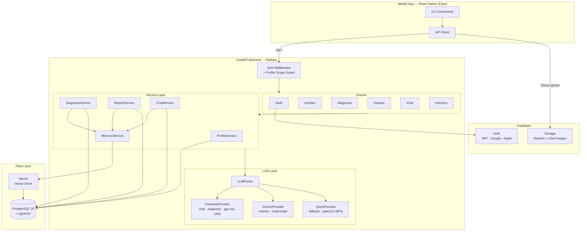
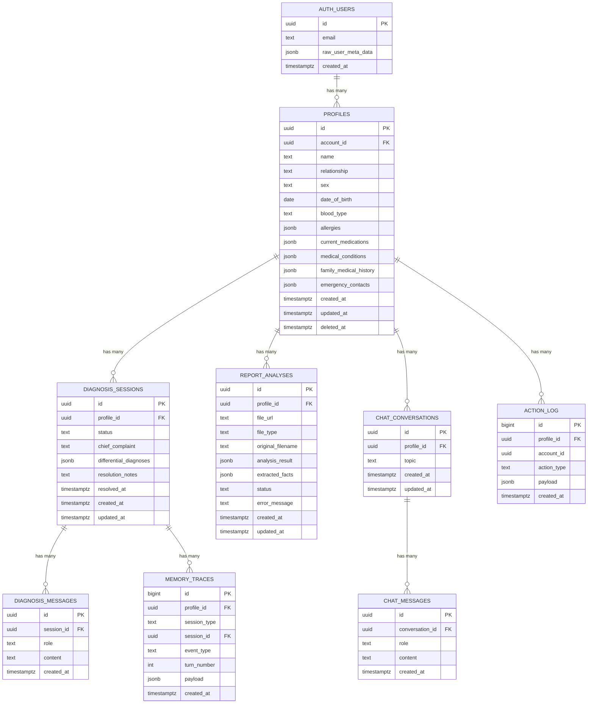
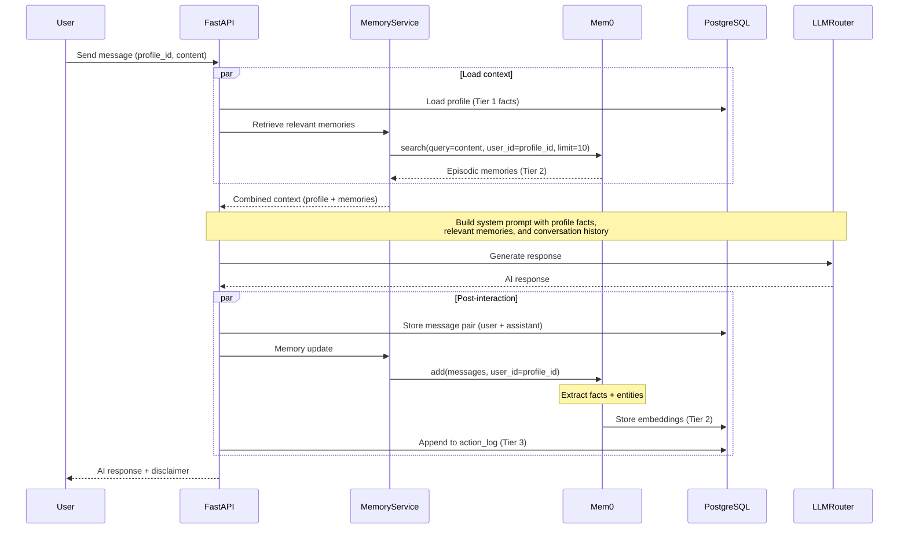
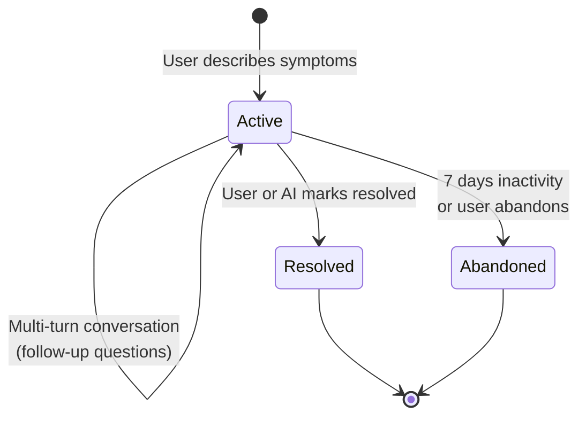
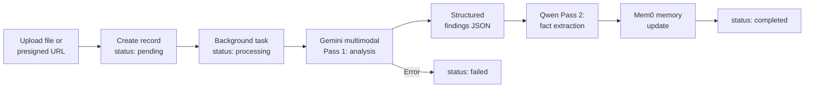
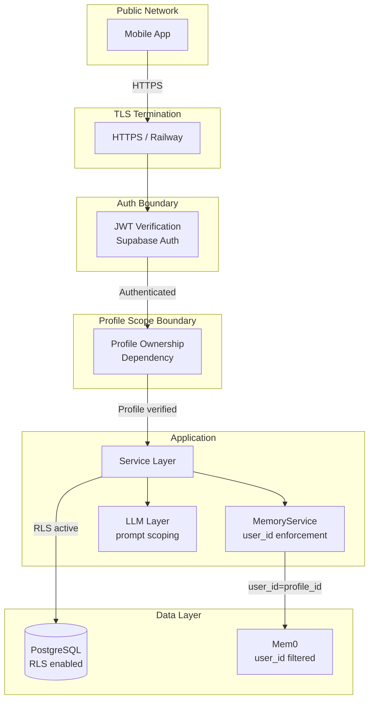

# FamilyHealth AI — Architecture

## Table of Contents

1. [System Architecture](#1-system-architecture)
2. [Database Schema](#2-database-schema)
3. [API Endpoints](#3-api-endpoints)
4. [Memory Architecture](#4-memory-architecture)
5. [LLM Integration Layer](#5-llm-integration-layer)
6. [Agent Infrastructure](#6-agent-infrastructure)
7. [Security Model](#7-security-model)

---

## 1. System Architecture



### Component Summary

| Component | Technology | Role |
|-|-|-|
| Mobile | React Native (Expo) | User-facing app, mobile-first |
| Auth | Supabase Auth | JWT tokens, Google/Apple sign-in |
| File Storage | Supabase Storage | Medical report PDFs and images |
| Backend | Python 3.12 + FastAPI | REST API, business logic, orchestration |
| Database | PostgreSQL 16 + pgvector | Persistent storage, vector similarity |
| Memory | Mem0 (self-hosted) | Episodic memory — vector store |
| LLM Primary | Cerebras (`gpt-oss-120b`) | Chat, diagnosis, extraction, summarization (default for all text tasks) |
| LLM Multimodal | Google Gemini API (`gemini-2.5-flash`) | Report analysis, multimodal, embeddings |
| LLM Fallback | Qwen via Ollama Cloud (`qwen3.5:397b`) | Fallback provider |
| Deployment | Railway (backend), Expo EAS (mobile) | Hosting |

---

## 2. Database Schema

### Design Decisions

- **JSONB for structured lists** (allergies, medications, conditions): the primary access pattern is "load full profile for LLM injection," not querying individual items. JSONB avoids junction table complexity while GIN indexes support filtering when needed.
- **UUIDs everywhere**: consistent with Supabase Auth `auth.users.id` and avoids sequential ID exposure.
- **Append-only `action_log`**: no UPDATE/DELETE grants — enforced at both app and DB level.
- **Mem0 storage**: separate database (`mem0_db`) on the same PostgreSQL instance for logical separation with minimal operational overhead.

### Entity-Relationship Diagram



### DDL

```sql
-- ============================================================
-- profiles
-- ============================================================
CREATE TABLE profiles (
    id                     UUID PRIMARY KEY DEFAULT gen_random_uuid(),
    account_id             UUID NOT NULL REFERENCES auth.users(id) ON DELETE CASCADE,
    name                   TEXT NOT NULL,
    relationship           TEXT NOT NULL
                               CHECK (relationship IN ('self','parent','spouse','child','sibling','other')),
    sex                    TEXT CHECK (sex IN ('male','female','other')),
    date_of_birth          DATE,
    blood_type             TEXT CHECK (blood_type IN ('A+','A-','B+','B-','AB+','AB-','O+','O-')),
    allergies              JSONB NOT NULL DEFAULT '[]',  -- [{allergen, severity, reaction?}]
    current_medications    JSONB NOT NULL DEFAULT '[]',  -- [{name, dosage, frequency}]
    medical_conditions     JSONB NOT NULL DEFAULT '[]',  -- [{condition, diagnosed?, status}]
    family_medical_history JSONB NOT NULL DEFAULT '{}',
    emergency_contacts     JSONB NOT NULL DEFAULT '[]',
    created_at             TIMESTAMPTZ NOT NULL DEFAULT now(),
    updated_at             TIMESTAMPTZ NOT NULL DEFAULT now(),
    deleted_at             TIMESTAMPTZ          -- NULL = active; set on soft delete
);

-- Soft-deleted profiles retain all data for 30 days before permanent deletion
-- via a scheduled cleanup job. Mem0 memories are deleted immediately on soft delete
-- to comply with data minimization.

CREATE INDEX idx_profiles_account    ON profiles(account_id) WHERE deleted_at IS NULL;
CREATE INDEX idx_profiles_allergies  ON profiles USING GIN (allergies);
CREATE INDEX idx_profiles_conditions ON profiles USING GIN (medical_conditions);

-- ============================================================
-- diagnosis_sessions
-- ============================================================
CREATE TABLE diagnosis_sessions (
    id                     UUID PRIMARY KEY DEFAULT gen_random_uuid(),
    profile_id             UUID NOT NULL REFERENCES profiles(id) ON DELETE CASCADE,
    status                 TEXT NOT NULL DEFAULT 'active'
                               CHECK (status IN ('active','resolved','abandoned')),
    chief_complaint        TEXT,
    differential_diagnoses JSONB DEFAULT '[]',
    resolution_notes       TEXT,
    resolved_at            TIMESTAMPTZ,
    created_at             TIMESTAMPTZ NOT NULL DEFAULT now(),
    updated_at             TIMESTAMPTZ NOT NULL DEFAULT now()
);

CREATE INDEX idx_diag_sessions_profile ON diagnosis_sessions(profile_id);
CREATE INDEX idx_diag_sessions_status  ON diagnosis_sessions(profile_id, status);

-- ============================================================
-- diagnosis_messages
-- ============================================================
CREATE TABLE diagnosis_messages (
    id            UUID PRIMARY KEY DEFAULT gen_random_uuid(),
    session_id    UUID NOT NULL REFERENCES diagnosis_sessions(id) ON DELETE CASCADE,
    role          TEXT NOT NULL CHECK (role IN ('user','assistant','system')),
    content       TEXT NOT NULL,
    content_parts JSONB,          -- rich content: text, image, tool_call, tool_result, agent_steps, memory_context
    metadata      JSONB,          -- model used, token counts, etc.
    created_at    TIMESTAMPTZ NOT NULL DEFAULT now()
);

CREATE INDEX idx_diag_msgs_session ON diagnosis_messages(session_id, created_at);

-- ============================================================
-- report_analyses
-- ============================================================
CREATE TABLE report_analyses (
    id                UUID PRIMARY KEY DEFAULT gen_random_uuid(),
    profile_id        UUID NOT NULL REFERENCES profiles(id) ON DELETE CASCADE,
    file_url          TEXT NOT NULL,
    file_type         TEXT NOT NULL DEFAULT 'unknown'
                          CHECK (file_type IN ('blood_test','xray','prescription','lab_report','other','unknown')),
    original_filename TEXT,
    analysis_result   JSONB,
    extracted_facts   JSONB DEFAULT '[]',
    status            TEXT NOT NULL DEFAULT 'pending'
                          CHECK (status IN ('pending','processing','completed','failed')),
    error_message     TEXT,
    created_at        TIMESTAMPTZ NOT NULL DEFAULT now(),
    updated_at        TIMESTAMPTZ NOT NULL DEFAULT now()
);

CREATE INDEX idx_reports_profile ON report_analyses(profile_id);
CREATE INDEX idx_reports_status  ON report_analyses(profile_id, status);

-- ============================================================
-- chat_conversations
-- ============================================================
CREATE TABLE chat_conversations (
    id         UUID PRIMARY KEY DEFAULT gen_random_uuid(),
    profile_id UUID NOT NULL REFERENCES profiles(id) ON DELETE CASCADE,
    topic      TEXT,
    created_at TIMESTAMPTZ NOT NULL DEFAULT now(),
    updated_at TIMESTAMPTZ NOT NULL DEFAULT now()
);

CREATE INDEX idx_chat_convos_profile ON chat_conversations(profile_id, updated_at);

-- ============================================================
-- chat_messages
-- ============================================================
CREATE TABLE chat_messages (
    id              UUID PRIMARY KEY DEFAULT gen_random_uuid(),
    conversation_id UUID NOT NULL REFERENCES chat_conversations(id) ON DELETE CASCADE,
    role            TEXT NOT NULL CHECK (role IN ('user','assistant','system')),
    content         TEXT NOT NULL,
    content_parts   JSONB,          -- rich content: text, image, tool_call, tool_result, agent_steps, memory_context
    metadata        JSONB,          -- model used, token counts, etc.
    created_at      TIMESTAMPTZ NOT NULL DEFAULT now()
);

CREATE INDEX idx_chat_msgs_convo ON chat_messages(conversation_id, created_at);

-- ============================================================
-- action_log (append-only)
-- ============================================================
CREATE TABLE action_log (
    id          BIGSERIAL PRIMARY KEY,
    profile_id  UUID NOT NULL REFERENCES profiles(id) ON DELETE CASCADE,
    account_id  UUID NOT NULL,
    action_type TEXT NOT NULL,
    payload     JSONB NOT NULL DEFAULT '{}',
    created_at  TIMESTAMPTZ NOT NULL DEFAULT now()
);

CREATE INDEX idx_action_log_profile ON action_log(profile_id, created_at);
CREATE INDEX idx_action_log_type    ON action_log(action_type, created_at);

-- Enforce append-only: revoke modification privileges
-- REVOKE UPDATE, DELETE ON action_log FROM app_user;

-- ============================================================
-- memory_traces (append-only, for memory eval)
-- ============================================================
CREATE TABLE memory_traces (
    id          BIGSERIAL PRIMARY KEY,
    profile_id  UUID NOT NULL REFERENCES profiles(id) ON DELETE CASCADE,
    session_type TEXT NOT NULL,        -- 'diagnosis', 'chat'
    session_id  UUID,                  -- FK to diagnosis_sessions or chat_conversations
    event_type  TEXT NOT NULL,         -- 'retrieval', 'extraction'
    turn_number INTEGER,
    payload     JSONB NOT NULL,        -- query, results, scores (retrieval) or facts, decisions (extraction)
    created_at  TIMESTAMPTZ NOT NULL DEFAULT now()
);

CREATE INDEX idx_memory_traces_session ON memory_traces(session_id, created_at);
CREATE INDEX idx_memory_traces_profile ON memory_traces(profile_id, created_at);
```

### JSONB Field Schemas

```jsonc
// profiles.allergies
[
  { "allergen": "penicillin", "severity": "severe", "reaction": "anaphylaxis" },
  { "allergen": "peanuts", "severity": "mild", "reaction": "hives" },
  { "allergen": "latex", "severity": "moderate" }
]

// profiles.current_medications
[
  { "name": "metformin", "dosage": "500mg", "frequency": "2x daily" },
  { "name": "lisinopril", "dosage": "10mg", "frequency": "1x daily" }
]

// profiles.medical_conditions
[
  { "condition": "type 2 diabetes", "diagnosed": "2019", "status": "active" },
  { "condition": "hypertension", "diagnosed": "2020", "status": "active" },
  { "condition": "appendicitis", "diagnosed": "2015", "status": "resolved" }
]

// profiles.family_medical_history
{
  "father": ["heart disease", "high cholesterol"],
  "mother": ["type 2 diabetes"],
  "maternal_grandmother": ["breast cancer"]
}

// profiles.emergency_contacts
[
  { "name": "Jane Doe", "phone": "+1-555-0123", "relationship": "spouse" }
]

// diagnosis_sessions.differential_diagnoses
[
  { "condition": "acute bronchitis", "confidence": 0.7, "reasoning": "persistent cough, no fever...", "action_plan": "Rest, fluids, OTC cough suppressant. See doctor if symptoms worsen or persist >10 days.", "urgency": "see_doctor_this_week" },
  { "condition": "allergic rhinitis", "confidence": 0.2, "reasoning": "seasonal pattern...", "action_plan": "Try OTC antihistamine. See doctor if no improvement in 1 week.", "urgency": "see_doctor_soon" }
]

// report_analyses.analysis_result
{
  "summary": "Complete blood count — all values within normal range except...",
  "findings": [
    { "name": "hemoglobin", "value": 14.2, "unit": "g/dL", "status": "normal", "reference_range": "12.0-17.5" },
    { "name": "total cholesterol", "value": 220, "unit": "mg/dL", "status": "elevated", "reference_range": "<200" }
  ],
  "recommendations": ["Dietary changes to reduce cholesterol", "Retest in 3 months"],
  "alerts": ["Elevated cholesterol — discuss with physician"]
}

// report_analyses.extracted_facts
["hemoglobin is 14.2 g/dL (normal)", "total cholesterol 220 mg/dL (elevated)", "blood test date: 2026-02-20"]
```

---

## 3. API Endpoints

All data endpoints are nested under `/profiles/{pid}` to enforce profile scoping at the route level. Every request requires a valid Supabase JWT in the `Authorization` header.

### Auth

| Method | Path | Description |
|-|-|-|
| POST | `/auth/verify` | Verify Supabase JWT, return internal session |
| GET | `/auth/me` | Get current account info from token |

### Profiles

| Method | Path | Description |
|-|-|-|
| GET | `/profiles` | List all profiles for the authenticated account |
| POST | `/profiles` | Create a new profile |
| GET | `/profiles/{pid}` | Get profile details |
| PATCH | `/profiles/{pid}` | Update profile fields (partial update) |
| DELETE | `/profiles/{pid}` | Soft-delete profile (30-day retention, Mem0 memories deleted immediately) |
| GET | `/profiles/{pid}/activity` | Paginated activity feed (action log), filterable by `?action_type=` |

### Diagnosis

| Method | Path | Description |
|-|-|-|
| POST | `/profiles/{pid}/diagnosis` | Start a new diagnosis session (provide initial symptoms) |
| POST | `/profiles/{pid}/diagnosis/create` | Create session record only (no LLM call, for streaming flow) |
| GET | `/profiles/{pid}/diagnosis` | List sessions, filterable by `?status=active\|resolved\|abandoned` |
| GET | `/profiles/{pid}/diagnosis/{sid}` | Get session details with full message history |
| POST | `/profiles/{pid}/diagnosis/{sid}/messages` | Send a message; returns AI response |
| POST | `/profiles/{pid}/diagnosis/stream` | Send a message with SSE streaming response |
| PATCH | `/profiles/{pid}/diagnosis/{sid}` | Update session: close/resolve, add resolution notes |
| PATCH | `/profiles/{pid}/diagnosis/{sid}/rename` | Rename session (update title) |
| DELETE | `/profiles/{pid}/diagnosis/{sid}` | Delete session + cascade messages + associated Mem0 memories |

### Reports

| Method | Path | Description |
|-|-|-|
| POST | `/profiles/{pid}/reports/upload` | Upload a medical report file (multipart: PDF, JPEG, PNG, WebP) |
| POST | `/profiles/{pid}/reports` | Create report record from presigned URL (JSON body) |
| GET | `/profiles/{pid}/reports` | List all report analyses for the profile |
| GET | `/profiles/{pid}/reports/{rid}` | Get specific analysis result |
| POST | `/profiles/{pid}/reports/{rid}/reanalyze` | Re-trigger analysis on an existing report |

### Chat

| Method | Path | Description |
|-|-|-|
| POST | `/profiles/{pid}/chat` | Send a chat message (creates or continues a conversation); returns AI response |
| POST | `/profiles/{pid}/chat/stream` | Send a chat message with SSE streaming response |
| GET | `/profiles/{pid}/chat` | List chat conversations, filterable by `?topic=` |
| GET | `/profiles/{pid}/chat/{cid}` | Get messages for a specific conversation |
| PATCH | `/profiles/{pid}/chat/{cid}` | Rename conversation (update topic) |
| DELETE | `/profiles/{pid}/chat/{cid}` | Delete conversation + cascade messages + associated Mem0 memories |

### Memory (Admin / Debug)

| Method | Path | Description |
|-|-|-|
| GET | `/profiles/{pid}/memory` | Get memory summary for the profile |
| GET | `/profiles/{pid}/memory/facts` | List extracted episodic memory facts |
| DELETE | `/profiles/{pid}/memory/{mid}` | Delete a specific memory entry (admin only) |

### Request / Response Conventions

- **Pagination**: `?page=1&per_page=20` on all list endpoints. Response includes `{ items, total, page, per_page }`.
- **Errors**: Standard HTTP status codes. Body: `{ "detail": "Human-readable message", "code": "MACHINE_CODE" }`.
- **Streaming**: SSE via `POST /chat/stream` and `POST /diagnosis/stream` endpoints. Events: `status`, `thinking_delta`, `text_delta`, `tool_call`, `tool_result`, `structured_question`, `done`, `error`.
- **Medical disclaimer**: Every diagnosis, report analysis, and chat response includes a `disclaimer` field:
  > "This is AI-generated health information, not a medical diagnosis. Always consult a qualified healthcare professional."

---

## 4. Memory Architecture

### Three-Tier System

```
┌─────────────────────────────────────────────────────────────────────┐
│                        Memory Architecture                         │
│                                                                     │
│  ┌─────────────────┐  ┌──────────────────────┐  ┌───────────────┐  │
│  │     Tier 1       │  │       Tier 2          │  │    Tier 3      │  │
│  │ Structured Facts │  │  Episodic Memory      │  │  Action Log    │  │
│  │   (PostgreSQL)   │  │     (Mem0)            │  │  (PostgreSQL)  │  │
│  │                  │  │                       │  │                │  │
│  │ • allergies      │  │ • Vector store        │  │ • Append-only  │  │
│  │ • medications    │  │   (pgvector)          │  │ • Full payload │  │
│  │ • conditions     │  │ • Semantic search     │  │ • Audit trail  │  │
│  │ • blood type     │  │ • Fact deduplication  │  │ • Replay/debug │  │
│  │ • family history │  │                       │  │                │  │
│  │ User-editable    │  │ Auto-extracted        │  │ System-managed │  │
│  └─────────────────┘  └──────────────────────┘  └───────────────┘  │
│                                                                     │
│  Updated by:          Updated by:                Updated by:        │
│  User profile edits   Post-interaction           Every significant  │
│  Manual profile edits extraction pipeline        system action      │
└─────────────────────────────────────────────────────────────────────┘
```

### Tier 1 — Structured Profile Facts

Stored in the `profiles` table. Deterministic, user-editable fields: allergies, medications, conditions, blood type, family history.

- **Loaded** into the LLM system prompt for every interaction.
- **Updated** via explicit user action (profile edit). Tier 2 facts are not auto-promoted to Tier 1 in v1.
- **Query pattern**: full row load by `profile_id`.

### Tier 2 — Episodic Memory (Mem0)

Mem0 stores conversational memories as vector embeddings (pgvector).

- **Scoped** per profile using `user_id=str(profile.id)` in every Mem0 API call.
- **Retrieved** via semantic search before each LLM call — the query is the user's current message.
- **Updated** after each interaction: Mem0's extraction LLM identifies new facts to persist.
- **Infrastructure**: same PostgreSQL instance, separate database (`mem0_db`).

**Mem0 Configuration:**

```python
from mem0 import Memory

mem0_config = {
    "vector_store": {
        "provider": "pgvector",
        "config": {
            "dbname": "mem0_db",
            "collection_name": "health_memories",
            "embedding_model_dims": 768,
            "host": PG_HOST,
            "port": PG_PORT,
            "user": PG_USER,
            "password": PG_PASSWORD,
            "hnsw": True,
            "minconn": 2,
            "maxconn": 10,
        },
    },
    "embedder": {
        "provider": "gemini",
        "config": {
            "model": "models/gemini-embedding-001",
            "api_key": GEMINI_API_KEY,
            "embedding_dims": 768,
        },
    },
    "llm": {
        "provider": "openai",
        "config": {
            "model": "nemotron-3-nano:30b",   # lightweight, non-thinking model for Mem0 internals
            "api_key": OLLAMA_API_KEY,
            "openai_base_url": "https://ollama.com/v1",
            "temperature": 0.1,
            "max_tokens": 2000,
        },
    },
}

memory = Memory.from_config(mem0_config)
```

### Tier 3 — Action Log

Append-only `action_log` table. Every significant action is recorded with full payload.

**Action types:**

| action_type | Trigger | Payload example |
|-|-|-|
| `profile_created` | New profile | `{ "name": "Mom", "relationship": "parent" }` |
| `profile_updated` | Profile edit | `{ "fields_changed": ["allergies"], "old": [...], "new": [...] }` |
| `profile_deleted` | Soft-delete | `{ "name": "Mom", "relationship": "parent" }` |
| `diagnosis_started` | New session | `{ "session_id": "...", "chief_complaint": "..." }` |
| `diagnosis_message` | Diagnosis turn | `{ "session_id": "...", "role": "user", "message_preview": "..." }` |
| `diagnosis_resolved` | Session closed | `{ "session_id": "...", "differential": [...] }` |
| `report_uploaded` | Report upload | `{ "report_id": "...", "file_type": "blood_test" }` |
| `report_analyzed` | Analysis done | `{ "report_id": "...", "findings_count": 5 }` |
| `chat_message` | Chat interaction | `{ "topic": "nutrition", "message_preview": "..." }` |
| `memory_updated` | Mem0 memory changed | `{ "memory_id": "...", "source": "diagnosis" }` |
| `memory_extracted` | New facts extracted | `{ "facts": ["hemoglobin 14.2 g/dL"], "source": "report" }` |
| `memory_deleted` | Admin action | `{ "memory_id": "...", "reason": "user request" }` |

### Runtime Memory Flow



---

## 5. LLM Integration Layer

### Architecture

All LLM interactions go through an abstract `LLMProvider` interface, with a `LLMRouter` that maps tasks to providers. This makes models swappable without touching business logic.

### Core Types

```python
from abc import ABC, abstractmethod
from collections.abc import AsyncIterator
from enum import Enum

from pydantic import BaseModel


class LLMTask(str, Enum):
    DIAGNOSIS = "diagnosis"
    REPORT_ANALYSIS = "report_analysis"
    MEMORY_EXTRACTION = "memory_extraction"
    CHAT = "chat"
    SUMMARIZATION = "summarization"
    FACT_EXTRACTION = "fact_extraction"


class LLMMessage(BaseModel):
    role: str  # "user" | "assistant" | "system"
    content: str


class LLMRequest(BaseModel):
    task: LLMTask
    system_prompt: str
    messages: list[LLMMessage]
    temperature: float = 0.7
    max_tokens: int | None = None
    response_format: dict | None = None  # structured output schema


class LLMResponse(BaseModel):
    content: str
    model: str
    usage: dict[str, int]  # {"prompt_tokens": ..., "completion_tokens": ...}
    raw_response: dict | None = None
```

### Provider Interface

```python
class LLMProvider(ABC):
    @abstractmethod
    async def generate(self, request: LLMRequest) -> LLMResponse:
        """Single-shot generation."""
        ...

    @abstractmethod
    async def generate_stream(self, request: LLMRequest) -> AsyncIterator[str]:
        """Streaming generation — yields content chunks."""
        ...
```

### Providers

```python
class GeminiProvider(LLMProvider):
    """Google Gemini API — used for diagnosis and report analysis.

    Models: gemini-2.5-flash (diagnosis), gemini-2.5-flash-lite (reports, fast tasks).
    Supports multimodal input (images for report analysis).
    """

    async def generate(self, request: LLMRequest) -> LLMResponse: ...
    async def generate_stream(self, request: LLMRequest) -> AsyncIterator[str]: ...


class QwenProvider(LLMProvider):
    """Qwen via Ollama Cloud (qwen3.5:397b) — used for extraction and summarization.
    Also used as base class for CerebrasProvider (same OpenAI-compatible API).

    Lower cost, fast inference for high-volume tasks. OpenRouter provides an OpenAI-compatible API.
    """

    async def generate(self, request: LLMRequest) -> LLMResponse: ...
    async def generate_stream(self, request: LLMRequest) -> AsyncIterator[str]: ...
```

### Router

```python
class LLMRouter:
    """Routes LLM tasks to the appropriate provider based on a configurable routing table."""

    # Base defaults (used when Cerebras unavailable and no env override)
    _BASE_DEFAULTS: dict[LLMTask, str] = {
        LLMTask.DIAGNOSIS: "gemini",
        LLMTask.REPORT_ANALYSIS: "gemini",
        LLMTask.MEMORY_EXTRACTION: "qwen",
        LLMTask.CHAT: "qwen",
        LLMTask.SUMMARIZATION: "qwen",
        LLMTask.FACT_EXTRACTION: "qwen",
    }

    # Tasks auto-upgraded to Cerebras when CEREBRAS_API_KEY is set
    _CEREBRAS_ELIGIBLE: set[LLMTask] = {
        LLMTask.CHAT, LLMTask.DIAGNOSIS, LLMTask.MEMORY_EXTRACTION,
        LLMTask.SUMMARIZATION, LLMTask.FACT_EXTRACTION,
    }

    def __init__(self) -> None:
        self._providers: dict[type[LLMProvider], LLMProvider] = {}

    def _get_provider(self, provider_cls: type[LLMProvider]) -> LLMProvider:
        if provider_cls not in self._providers:
            self._providers[provider_cls] = provider_cls()
        return self._providers[provider_cls]

    async def route(self, request: LLMRequest) -> LLMResponse:
        provider = self._get_provider(self.ROUTING_TABLE[request.task])
        return await provider.generate(request)

    async def route_stream(self, request: LLMRequest) -> AsyncIterator[str]:
        provider = self._get_provider(self.ROUTING_TABLE[request.task])
        async for chunk in provider.generate_stream(request):
            yield chunk
```

### Routing Summary

| Task | Default Provider | Model | Rationale |
|-|-|-|-|
| Diagnosis | Cerebras | gpt-oss-120b | Fast inference, tool calling. Gemini via `LLM_ROUTE_DIAGNOSIS=gemini` |
| Report Analysis | Gemini | gemini-2.5-flash | Multimodal (image/PDF input), structured extraction |
| Memory Extraction | Cerebras | gpt-oss-120b | Fast inference for high-volume background extraction |
| Chat | Cerebras | gpt-oss-120b | Low latency conversational turns |
| Summarization | Cerebras | gpt-oss-120b | Straightforward text task |
| Fact Extraction | Cerebras | gpt-oss-120b | Structured output; used for post-session state extraction |

Routing is env-configurable via `LLM_ROUTE_*` vars. Cerebras is auto-assigned for all eligible tasks when `CEREBRAS_API_KEY` is set. Gemini is the fallback for diagnosis/reports. Qwen (`qwen3.5:397b`) is the final fallback. Auto-fallback on provider failure.

### Diagnosis Session Flow



**Diagnosis interaction steps (hypothesis-driven agentic):**

1. User creates session with initial symptom description (chief complaint).
2. **Red flag pre-check**: backend scans message for emergency keywords (chest pain, stroke signs, suicidal ideation, etc.). If detected, returns a templated emergency response immediately — no LLM call.
3. **Context assembly**: `ContextBuilder` loads profile (Tier 1) + retrieves relevant episodic memories from Mem0 (Tier 2, limit=10, threshold=0.15). Injects into the diagnosis system prompt. Memory retrieval is recorded to `memory_traces` for eval.
4. **Conversation enrichment**: `_enrich_content()` prepends question context to user messages and recovers empty assistant messages from `present_question` tool calls. Rejected options included to prevent re-asking.
5. **Agentic loop**: `AgentCore.run_stream()` with `DIAGNOSIS_AGENT` definition — Cerebras (or Gemini) follows hypothesis-driven reasoning: forms 3-5 hypotheses, asks targeted questions via `present_question` terminal tool, uses `web_search` for evidence. OLDCARTS as coverage audit, not rigid script. Max 6 tool rounds, turn 8 hard cap.
6. **Agent resilience**: Empty response retry (nudge if thinking but no text), incomplete response nudge (if text but no tool call and not an assessment), assessment marker detection (stops extra tool calls when `## Assessment` present).
7. **Safety validation**: backend scans the LLM response against prohibited patterns (dosage prescriptions, cancer claims, "don't need a doctor"). Violations trigger a safety notice appended to the response.
8. **State extraction (post-DONE)**: Non-blocking `_extract_state()` uses `FACT_EXTRACTION` task to extract structured diagnosis state.
9. Both user and assistant messages stored in `diagnosis_messages` with `content_parts` JSONB and debug `metadata` (enriched history, agent rounds, memories used). Differential diagnoses (if any) stored on the session.
10. **Background**: `MemoryExtractor` fires via `BackgroundTasks` to extract facts to Mem0. Extraction events recorded to `memory_traces`.
11. Medical disclaimer injected by backend into every response (never relies on LLM).
12. On resolution: resolution summary extracted to long-term memory, action logged.

### Chat Flow

**Chat interaction steps (single-pass):**

1. User sends a message with optional `conversation_id` to continue an existing conversation. If omitted, a new `chat_conversations` record is created.
2. **Mental health crisis pre-check**: backend scans message for crisis keywords (suicidal ideation, self-harm, etc.). If detected, returns a crisis response with 988 Lifeline/Crisis Text Line resources immediately — no LLM call.
3. **Context assembly**: `ContextBuilder` loads profile (Tier 1) + retrieves relevant episodic memories from Mem0 (Tier 2, limit=10, threshold=0.1). Injects into the chat system prompt.
4. **Conversation history**: loads existing messages for the conversation, applies sliding window to fit within context budget.
5. **LLM call (agentic)**: `AgentCore.run_stream()` with `CHAT_AGENT` definition — Cerebras (or Qwen fallback) generates a conversational health advisor response (temp=0.7, max_tokens=2000). Agent can invoke `search_patient_memory` and `web_search` tools during the loop (max 3 rounds).
6. **Safety validation**: backend scans response for prohibited patterns (specific dosages, "you don't need a doctor"). Violations trigger a safety notice appended to the response.
7. User and assistant messages stored in `chat_messages`. Conversation `updated_at` refreshed.
8. **Topic auto-generation**: on the first message of a new conversation (no explicit topic provided), `AgentCore.call()` with `SUMMARIZATION` task generates a short 3-6 word topic label. Best-effort — failure does not block the response.
9. **Background**: `MemoryExtractor` fires via `BackgroundTasks` to extract facts to Mem0 (category: `general`, source: `chat:{conversation_id}`).
10. Medical disclaimer injected by backend into every response.
11. Action logged: `chat_message` with conversation ID, topic, and message preview.

### Report Analysis Flow



1. **Upload**: two flows supported — (a) mobile uploads to Supabase Storage, then sends presigned URL via `POST /reports` (JSON); (b) direct file upload via `POST /reports/upload` (multipart). Both create a `report_analyses` record with `status='pending'` and trigger background analysis.
2. **Analysis (Pass 1)**: `ReportAnalyzerService` sends the file bytes to Gemini 2.5 Flash via `AgentCore.run()` with `REPORT_AGENT` definition. Uses `Part.from_bytes()` (native multimodal — PDFs and images handled directly, no OCR). Profile context and relevant episodic memories injected via `ContextBuilder`. JSON mode response parsed into `AnalysisResult { summary, findings[], alerts[], recommendations[] }`.
3. **Extraction (Pass 2)**: Qwen (`FACT_EXTRACTION` task) extracts discrete facts from the analysis result for long-term memory storage. Best-effort — failure does not block analysis completion.
4. **Memory update**: extracted facts stored via `MemoryExtractor.extract_and_store()` with `category="lab_results"`, `source="report:{id}"`.
5. **Completion**: `status='completed'`, `analysis_result` and `extracted_facts` populated. Medical disclaimer injected by backend into every response.

### Background Tasks

Post-interaction memory extraction uses FastAPI's `BackgroundTasks`. The extraction pipeline runs after the AI response is sent to the user, so it never blocks the request. Diagnosis and chat routes wire this via `background_tasks.add_task(memory_extractor.extract_and_store, ...)` — `MemoryExtractor` is passed directly, not through the service, so it doesn't hold a reference to the request-scoped DB session. If the server restarts mid-extraction, the memory update is lost — but the same facts will be re-extracted on the next interaction. For v2, consider a task queue (arq + Redis) for reliability and retry support.

---

## 6. Agent Infrastructure

Diagnosis, report analysis, and chat share a reusable agent infrastructure in `app/agents/`. The pattern separates the agentic loop from feature-specific logic.

### Components

| Component | File | Role |
|-|-|-|
| `AgentCore` | `agents/core.py` | Reusable loop: LLM → tool calls → execution → repeat |
| `AgentDefinition` | `agents/core.py` | Configuration per agent type (task, tools, params) |
| `AgentSession` | `agents/session.py` | Ephemeral per-interaction state |
| `ToolRegistry` | `agents/registry.py` | Registers tools at startup, executes on behalf of agents |
| `ToolDefinition` | `agents/types.py` | Declares a tool with JSON Schema parameters and handler |

### Agent Definitions

| Agent | LLM Task | Tools | Default Provider | Max Rounds |
|-|-|-|-|-|
| DIAGNOSIS_AGENT | DIAGNOSIS | search_patient_memory, present_question, web_search | Cerebras (Gemini via env) | 6 |
| REPORT_AGENT | REPORT_ANALYSIS | (none — JSON mode) | Gemini | 0 |
| CHAT_AGENT | CHAT | search_patient_memory, web_search | Cerebras | 3 |

### Usage Pattern

Services use `AgentCore.run()` for agentic interactions (tool-calling loop) and `AgentCore.call()` for simple non-agentic LLM calls (extraction, summarization). The `get_agent_core()` singleton in `deps.py` initializes the registry with `search_patient_memory` and `get_profile_context` tools at startup.

**Gemini limitation**: JSON mode (`response_mime_type=application/json`) and function calling (`tools=`) are mutually exclusive. REPORT_AGENT uses JSON mode (no tools); DIAGNOSIS_AGENT uses tools (no JSON mode).

---

## 7. Security Model

### Profile Segregation — Four Layers

This is the most critical security boundary in the system. A multi-layered approach ensures that profile A's data can never leak into profile B's context.

**Layer 1 — Route-level (FastAPI dependency)**

Every endpoint under `/profiles/{pid}` uses a dependency that verifies the authenticated account owns the requested profile:

```python
async def get_verified_profile(
    pid: UUID,
    account: Account = Depends(get_current_account),
    db: AsyncSession = Depends(get_db),
) -> Profile:
    profile = await db.get(Profile, pid)
    if not profile or profile.account_id != account.id:
        raise HTTPException(status_code=404)  # 404, not 403 — don't leak existence
    return profile
```

**Layer 2 — Database-level (PostgreSQL Row-Level Security)**

```sql
ALTER TABLE profiles ENABLE ROW LEVEL SECURITY;
CREATE POLICY profiles_account_isolation ON profiles
    USING (account_id = current_setting('app.current_account_id')::uuid);

-- Applied per-request via middleware:
-- SET LOCAL app.current_account_id = '<account_uuid>';

-- Same pattern for all profile-scoped tables:
ALTER TABLE diagnosis_sessions ENABLE ROW LEVEL SECURITY;
CREATE POLICY diag_sessions_isolation ON diagnosis_sessions
    USING (profile_id IN (
        SELECT id FROM profiles
        WHERE account_id = current_setting('app.current_account_id')::uuid
    ));

-- Repeat for: report_analyses, chat_conversations, action_log
-- (chat_messages are scoped via chat_conversations.profile_id)
```

**Layer 3 — Mem0-level (MemoryService wrapper)**

The `MemoryService` enforces profile scoping on every Mem0 call. No public method exists without a `profile_id` parameter:

```python
import asyncio

# All Mem0 calls are sync — wrapped in asyncio.to_thread() to avoid blocking the FastAPI event loop.

class MemoryService:
    def __init__(self, mem0_client: Memory) -> None:
        self._mem0 = mem0_client

    async def search(self, profile_id: UUID, query: str, limit: int = 10) -> list[dict]:
        result = await asyncio.to_thread(
            self._mem0.search, query, user_id=str(profile_id), limit=limit
        )
        return result.get("results", [])

    async def add(self, profile_id: UUID, messages: list[dict]) -> None:
        await asyncio.to_thread(self._mem0.add, messages, user_id=str(profile_id))

    async def get_all(self, profile_id: UUID) -> list[dict]:
        result = await asyncio.to_thread(self._mem0.get_all, user_id=str(profile_id))
        return result.get("results", [])

    async def delete(self, profile_id: UUID, memory_id: str) -> None:
        # Verify memory belongs to profile before deletion
        memory = await asyncio.to_thread(self._mem0.get, memory_id)
        if memory.get("user_id") != str(profile_id):
            raise ValueError("Memory does not belong to this profile")
        await asyncio.to_thread(self._mem0.delete, memory_id)
```

**Layer 4 — LLM-level (system prompt scoping)**

Every system prompt explicitly scopes the AI to the target profile:

```
You are a health assistant for {profile.name}.
You must ONLY discuss and reference health information related to this specific individual.
Do not reference, compare, or reveal information about any other individual.
```

### Security Summary

| Concern | Mechanism |
|-|-|
| Authentication | Supabase Auth JWT verified server-side on every request |
| Authorization | Profile ownership check via FastAPI dependency injection |
| Data isolation | RLS on PostgreSQL + `user_id` scoping on Mem0 + route-level guards |
| Encryption at rest | PostgreSQL encryption (Supabase-managed) + Supabase Storage encryption |
| Encryption in transit | HTTPS everywhere — Railway provides TLS termination |
| Medical disclaimer | Injected into every diagnosis/analysis response automatically |
| Audit trail | Append-only `action_log` — no UPDATE or DELETE privileges |
| LLM data safety | Profile-scoped system prompts; no cross-profile context ever loaded |
| File storage | Presigned URLs with expiry; files namespaced by `profiles/{pid}/` in storage bucket |
| Secrets management | API keys via environment variables, never in code or logs |

### Data Flow — Security Boundaries



---

## 8. Environment Variables

All configuration is via environment variables. Never commit secrets to code or logs.

```bash
# Database
PG_HOST=localhost
PG_PORT=5432
PG_USER=familyhealth
PG_PASSWORD=changeme
PG_DATABASE=familyhealth
PG_MEM0_DATABASE=mem0_db

# Supabase
SUPABASE_URL=https://your-project.supabase.co
SUPABASE_JWT_SECRET=your-jwt-secret
SUPABASE_SERVICE_KEY=your-service-key

# LLM — Gemini (diagnosis, report analysis, embeddings)
GEMINI_API_KEY=your-gemini-key
GEMINI_DIAGNOSIS_MODEL=gemini-2.5-flash
GEMINI_REPORT_MODEL=gemini-2.5-flash
GEMINI_FLASH_MODEL=gemini-2.5-flash-lite
EMBEDDING_MODEL=models/gemini-embedding-001
EMBEDDING_DIMS=768

# LLM — Qwen via Ollama Cloud (extraction, summarization, mem0 internal LLM)
QWEN_API_KEY=your-ollama-api-key
QWEN_BASE_URL=https://ollama.com/v1
QWEN_MODEL=qwen3.5:397b

# LLM — Cerebras (chat, optional — falls back to Qwen if unset)
CEREBRAS_API_KEY=your-cerebras-key
CEREBRAS_BASE_URL=https://api.cerebras.ai/v1
CEREBRAS_MODEL=gpt-oss-120b

# App
APP_ENV=development
LOG_LEVEL=info
```
