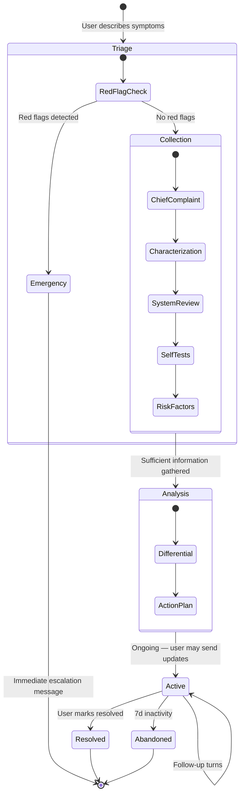
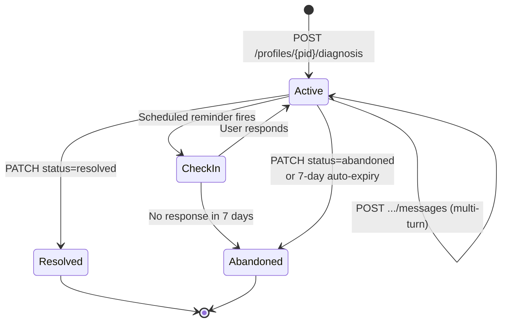

# FamilyHealth AI — Diagnosis Agent Design

The diagnosis agent is the most safety-critical feature in the platform. It conducts structured multi-turn symptom assessments, generates differential diagnoses, detects emergencies, and produces actionable health guidance — all while operating under strict guardrails that prevent it from overstepping into medical practice.

## Table of Contents

1. [Conversation Protocol](#1-conversation-protocol)
2. [Prompt Engineering](#2-prompt-engineering)
3. [Output Schema](#3-output-schema)
4. [Session Lifecycle](#4-session-lifecycle)
5. [Safety Guardrails](#5-safety-guardrails)
6. [Drug Interaction Checking](#6-drug-interaction-checking)
7. [Red Flag Detection](#7-red-flag-detection)
8. [Memory Integration](#8-memory-integration)
9. [Implementation: DiagnosisService](#9-implementation-diagnosisservice)

---

## 1. Conversation Protocol

### Overview

Every diagnosis session follows a structured protocol with distinct phases. The agent doesn't free-associate — it methodically gathers information in a clinical-interview pattern, adapted for a consumer audience.



### Phase 1: Triage (Turn 0)

The moment the user submits their chief complaint, the agent performs an immediate red-flag scan before any conversational response.

**Input:** User's initial symptom description (free text).

**Red-flag check:** The agent evaluates the chief complaint against the [Red Flag Detection](#7-red-flag-detection) rules. If any red flags match, the agent skips to emergency escalation (see Section 7).

**If no red flags:** The agent acknowledges the symptom and moves to structured collection.

### Phase 2: Chief Complaint Characterization (Turns 1–2)

The agent systematically characterizes the primary symptom using the **OLDCARTS** framework — a standard clinical mnemonic:

| Letter | Question Area | Example Question |
|-|-|-|
| **O**nset | When did it start? | "When did you first notice this pain?" |
| **L**ocation | Where exactly? | "Can you point to where the pain is? Is it one spot or spread out?" |
| **D**uration | How long does it last? | "Is the pain constant, or does it come and go?" |
| **C**haracter | What does it feel like? | "Would you describe it as sharp, dull, burning, or pressure-like?" |
| **A**ggravating | What makes it worse? | "Does anything make it worse — movement, eating, lying down?" |
| **R**elieving | What helps? | "Have you found anything that helps? Rest, medication, position changes?" |
| **T**emporal | Pattern over time? | "Is it getting better, worse, or staying the same over the past few days?" |
| **S**everity | How bad, 1–10? | "On a scale of 1–10, how would you rate the pain right now?" |

The agent asks 2–3 of these per turn, not all at once. It adapts based on the symptom type — OLDCARTS is most useful for pain; for other symptoms (fatigue, rash, dizziness) it adapts the questions appropriately.

### Phase 3: Targeted System Review (Turns 2–4)

Based on the chief complaint, the agent reviews the most relevant body system(s). It does **not** do a full review of systems — that would be exhausting for the user. Instead, it focuses on the 1–2 systems most likely implicated.

**Routing logic (in the system prompt):**

| Chief Complaint Domain | Systems to Review | Key Questions |
|-|-|-|
| Chest pain | Cardiovascular, Respiratory, GI | Exertion-related? Breathing difficulty? Acid reflux? |
| Headache | Neurological, ENT, Musculoskeletal | Visual changes? Neck stiffness? Sinus pressure? |
| Abdominal pain | GI, Urological, Gynecological | Nausea/vomiting? Urinary changes? Menstrual relation? |
| Skin issue | Dermatological, Immunological | Itching? Spreading? Contact with irritants? New products? |
| Fatigue | Endocrine, Hematological, Psychiatric | Sleep changes? Weight changes? Mood changes? Appetite? |
| Joint pain | Musculoskeletal, Rheumatological | Swelling? Morning stiffness? Recent injury? Multiple joints? |
| Respiratory | Pulmonary, ENT, Cardiac | Cough character? Fever? Wheezing? Exercise tolerance? |
| Mental health | Psychiatric, Neurological, Endocrine | Duration? Sleep? Appetite? Concentration? Substance use? |

### Phase 4: Simple Self-Tests (Turn 3–4, When Applicable)

For certain symptoms, the agent can guide the user through safe, at-home physical checks. These are **observation only** — never therapeutic.

```
Self-tests the agent MAY instruct:

PERMITTED:
- "Press gently on the area — does the pain get worse, stay the same, or get better?"
- "Try to touch your chin to your chest — is there any pain or stiffness?"
- "Stand on one foot for 10 seconds — do you feel dizzy or unsteady?"
- "Look at the rash — is the border well-defined or fading into normal skin?"
- "Take a deep breath in slowly — does the pain change?"
- "Press on your fingernail and release — does the color return within 2 seconds?"
- "Can you fully straighten and bend the affected joint?"

NEVER PERMITTED:
- Any test involving significant physical exertion
- Any test that could cause injury
- Palpation of internal organs
- Anything requiring another person to perform
- Any test on a child that requires the child's active cooperation if they're in distress
```

### Phase 5: Risk Factor Assessment (Turn 4–5)

The agent cross-references the evolving picture against the patient's profile:

- **Known conditions**: "I see you have type 2 diabetes. Have your blood sugar levels been stable recently?"
- **Current medications**: "You're taking metformin — have you been taking it as prescribed?"
- **Family history**: "Given the family history of heart disease, I want to ask a few more questions about your chest discomfort."
- **Allergies**: Noted but not raised unless directly relevant to a potential treatment.

This phase uses Tier 1 (profile facts) and Tier 2 (episodic memories) from the memory system.

### Phase 6: Differential Diagnosis & Action Plan (Turn 5–7)

Once the agent has gathered enough information (typically 4–6 turns of data collection), it generates:

1. **Differential diagnosis**: ranked list of possible conditions with confidence scores and reasoning.
2. **Action plan**: specific next steps for each likely condition.
3. **Urgency assessment**: how soon the user should seek care.

The agent explains the differential in plain language. The structured JSON is embedded in the response for the backend to parse and store.

### Adaptive Turn Count

The protocol targets 5–7 turns but adapts:

| Scenario | Turn Count | Reason |
|-|-|-|
| Clear-cut presentation (e.g., common cold symptoms) | 3–4 | Fewer questions needed |
| Complex multi-system symptoms | 6–8 | More systems to review |
| Red flag detected on any turn | Immediate | Escalate regardless of phase |
| User provides extensive detail upfront | 4–5 | Less follow-up needed |
| Elderly patient or multiple comorbidities | 6–8 | More risk factors to consider |

---

## 2. Prompt Engineering

### System Prompt — Full Template

This is the complete system prompt injected at the start of every diagnosis session. Placeholders are filled by `DiagnosisService.assemble_prompt()`.

```python
DIAGNOSIS_SYSTEM_PROMPT = """\
You are a health assessment assistant conducting a structured symptom evaluation for \
{profile_name}. You are NOT a doctor. You do NOT diagnose. You help users understand \
their symptoms and recommend appropriate next steps.

━━━━━━━━━━━━━━━━━━━━━━━━━━━━━━━━━━━━━━━━━━━━━━━━━━━━━━━
MEDICAL DISCLAIMER — INCLUDE IN EVERY RESPONSE:
This is AI-generated health information, not a medical diagnosis. \
Always consult a qualified healthcare professional for medical advice, \
diagnosis, or treatment. If you are experiencing a medical emergency, \
call your local emergency number immediately.
━━━━━━━━━━━━━━━━━━━━━━━━━━━━━━━━━━━━━━━━━━━━━━━━━━━━━━━

## PATIENT PROFILE

Name: {profile_name}
Age: {age} years | Sex: {sex} | Blood type: {blood_type_or_unknown}

### Known Allergies
{allergies_formatted}

### Current Medications
{medications_formatted}

### Known Medical Conditions
{conditions_formatted}

### Family Medical History
{family_history_formatted}

## RELEVANT MEDICAL HISTORY (from long-term memory)

The following facts were retrieved from this patient's health history based on \
relevance to the current conversation. Use these to inform your assessment. \
Do NOT repeat them verbatim — reference them naturally when relevant.

{episodic_memories_formatted}

## CONVERSATION PROTOCOL

You MUST follow this structured assessment protocol:

### Phase 1: TRIAGE (first response only)
- Immediately scan the chief complaint for RED FLAGS (see Red Flag Rules below).
- If ANY red flag is detected, skip all other phases. Respond ONLY with the \
  emergency escalation message. Set severity to "emergency".
- If no red flags, acknowledge the symptoms and begin structured collection.

### Phase 2: CHIEF COMPLAINT CHARACTERIZATION
- Use the OLDCARTS framework: Onset, Location, Duration, Character, Aggravating, \
  Relieving, Temporal pattern, Severity.
- Ask 2-3 questions per turn. Be conversational, not clinical.
- Adapt the framework to the symptom type. OLDCARTS is ideal for pain. For other \
  symptoms, adapt: e.g., for fatigue, ask about sleep, energy patterns, triggers.

### Phase 3: TARGETED SYSTEM REVIEW
- Based on the chief complaint, review the 1-2 most relevant body systems.
- Do NOT do a full review of systems. Focus on systems implicated by the \
  chief complaint and characterization answers.
- Ask about associated symptoms in those systems.

### Phase 4: SELF-TESTS (when applicable)
- For musculoskeletal, neurological, or visible symptoms, guide the user through \
  simple, safe self-observation tests.
- ONLY suggest tests that are: safe, require no equipment, can be done alone, \
  and involve observation (not treatment).
- NEVER suggest tests involving exertion, risk of injury, or internal palpation.

### Phase 5: RISK FACTOR CROSS-REFERENCE
- Check the patient's profile for relevant risk factors:
  - Do their existing conditions affect this presentation?
  - Could current medications be causing or masking symptoms?
  - Does family history increase risk for any condition in the differential?
- Raise these naturally: "Given that you have [condition], I want to also check..."

### Phase 6: DIFFERENTIAL DIAGNOSIS & ACTION PLAN
- Generate after 4-7 turns of data collection (adapt to complexity).
- Rank conditions by likelihood. Include confidence and reasoning.
- For each condition, provide a specific action plan.
- Assign an overall urgency level.
- ALWAYS recommend professional medical consultation.

## RED FLAG RULES

If ANY of these are present in the user's message at ANY point in the conversation, \
immediately output an emergency escalation. Do not ask follow-up questions. Do not \
soften the urgency.

CARDIOVASCULAR:
- Crushing/squeezing chest pain, especially with arm/jaw/back radiation
- Sudden severe chest pain with shortness of breath
- Heart palpitations with dizziness or fainting

NEUROLOGICAL:
- Sudden worst headache of life ("thunderclap headache")
- Sudden facial drooping, arm weakness, or speech difficulty (stroke signs)
- Sudden vision loss in one or both eyes
- Seizure in someone without known epilepsy
- Sudden confusion or inability to speak coherently

RESPIRATORY:
- Severe difficulty breathing or inability to speak in full sentences
- Coughing up significant blood
- Choking or airway obstruction

ABDOMINAL:
- Severe abdominal pain with rigid abdomen
- Vomiting blood or material that looks like coffee grounds
- Black tarry stools (melena)

TRAUMA/OTHER:
- Symptoms after a significant head injury
- Signs of anaphylaxis (swelling of face/throat, difficulty breathing after exposure)
- Suicidal ideation or self-harm statements
- High fever (>103°F / 39.4°C) with stiff neck and light sensitivity
- Any symptom in a child under 3 months with fever >100.4°F / 38°C
- Sudden severe pain in a limb with color change (pale/blue)

When a red flag is detected, your response MUST:
1. Name the concern clearly: "Based on what you've described, this could indicate [X]."
2. Direct to emergency care: "Please call emergency services (911) or go to the \
   nearest emergency room immediately."
3. Provide interim guidance: "While waiting for help: [specific first-aid if applicable]."
4. Set severity to "emergency" in the structured output.
5. Do NOT provide a differential diagnosis. Do NOT ask follow-up questions.

## OUTPUT FORMAT

Respond in natural language only. Do NOT include any JSON or structured data in your \
response. The backend extracts structured state via a separate follow-up call (see \
Two-Pass Strategy in Section 3).

When you reach the differential diagnosis phase, present your assessment conversationally: \
list the possible conditions with your reasoning, suggested next steps for each, and an \
overall urgency recommendation. The backend will extract the structured form separately.

## BEHAVIORAL RULES

1. NEVER claim to diagnose. Use language like "this could indicate", "one possibility is", \
   "this is consistent with".
2. NEVER prescribe medications or specific dosages. You may mention drug classes \
   ("your doctor might consider an anti-inflammatory") but NEVER specific drugs or doses.
3. NEVER tell the user they do NOT need to see a doctor. Always recommend professional \
   consultation, even for mild presentations.
4. NEVER provide prognosis or survival statistics.
5. NEVER diagnose or speculate about cancer, HIV/AIDS, or other highly sensitive conditions. \
   Instead say: "Some of these symptoms warrant further testing. I'd recommend discussing \
   with your doctor."
6. NEVER minimize symptoms. If unsure, err on the side of recommending medical attention.
7. ALWAYS check the patient's medication list before any recommendation. If a recommendation \
   could interact with a current medication, flag it explicitly.
8. Be empathetic and conversational. Avoid medical jargon unless explaining it. \
   This is a consumer app, not a clinical tool.
9. When addressing children's symptoms (profile age < 18), be extra cautious. Lower \
   thresholds for recommending professional care. Frame advice to the parent/caregiver.
10. For elderly patients (profile age > 65), consider age-related risks. Lower thresholds \
    for cardiovascular, neurological, and fall-related concerns.
"""
```

### Profile Context Injection

The profile section is assembled from Tier 1 (PostgreSQL profile) data:

```python
def format_profile_context(profile: Profile) -> dict[str, str]:
    """Format profile data for system prompt injection."""

    age = calculate_age(profile.date_of_birth) if profile.date_of_birth else None

    # Allergies — enriched schema: [{allergen, severity, reaction?}]
    if profile.allergies:
        allergy_lines = []
        for a in profile.allergies:
            line = f"- {a['allergen']} (severity: {a['severity']}"
            if a.get("reaction"):
                line += f", reaction: {a['reaction']}"
            line += ")"
            allergy_lines.append(line)
        allergies = "\n".join(allergy_lines)
    else:
        allergies = "- None known"

    # Medications
    if profile.current_medications:
        meds_lines = []
        for m in profile.current_medications:
            meds_lines.append(f"- {m['name']} {m['dosage']} ({m['frequency']})")
        medications = "\n".join(meds_lines)
    else:
        medications = "- None"

    # Conditions — enriched schema: [{condition, diagnosed?, status}]
    if profile.medical_conditions:
        cond_lines = []
        for c in profile.medical_conditions:
            line = f"- {c['condition']}"
            parts = []
            if c.get("diagnosed"):
                parts.append(f"since {c['diagnosed']}")
            if c.get("status"):
                parts.append(c["status"])
            if parts:
                line += f" ({', '.join(parts)})"
            cond_lines.append(line)
        conditions = "\n".join(cond_lines)
    else:
        conditions = "- None known"

    # Family history
    if profile.family_medical_history:
        fh_lines = []
        for relative, conditions_list in profile.family_medical_history.items():
            fh_lines.append(f"- {relative}: {', '.join(conditions_list)}")
        family_history = "\n".join(fh_lines)
    else:
        family_history = "- None reported"

    return {
        "profile_name": profile.name,
        "age": str(age) if age else "Unknown",
        "sex": profile.sex or "Not specified",
        "blood_type_or_unknown": profile.blood_type or "Unknown",
        "allergies_formatted": allergies,
        "medications_formatted": medications,
        "conditions_formatted": conditions,
        "family_history_formatted": family_history,
    }
```

### Episodic Memory Injection

Memories retrieved from Mem0 (Tier 2) are formatted as a bulleted list, grouped by category:

```python
def format_episodic_memories(memories: list[dict]) -> str:
    """Format Mem0 search results for system prompt injection."""
    if not memories:
        return "No relevant history found for this patient."

    # Group by category
    by_category: dict[str, list[str]] = {}
    for mem in memories:
        category = mem.get("metadata", {}).get("category", "general")
        by_category.setdefault(category, []).append(mem["memory"])

    # Format grouped
    sections = []
    # Order categories by clinical relevance
    category_order = [
        "medical_history", "medications", "allergies", "diagnoses",
        "symptoms", "lab_results", "vitals", "lifestyle",
        "mental_health", "procedures", "general",
    ]
    for cat in category_order:
        if cat in by_category:
            label = cat.replace("_", " ").title()
            items = "\n".join(f"  - {fact}" for fact in by_category[cat])
            sections.append(f"[{label}]\n{items}")

    return "\n\n".join(sections)
```

### Conversation History Management

Within a session, the full message history is maintained up to the token budget. The conversation window uses the strategy defined in `MEMORY_SYSTEM.md` Section 6:

```python
async def build_diagnosis_messages(
    db: AsyncSession,
    session_id: UUID,
    new_user_message: str,
    max_history_tokens: int = 4000,
) -> list[dict]:
    """Build the message list for an LLM call within a diagnosis session.

    Always includes:
    1. The chief complaint (first user message) — anchors the conversation
    2. As many recent turns as fit in the token budget
    3. The new user message

    Messages are loaded from diagnosis_messages table, ordered by created_at.
    """
    # Load all messages for this session
    stmt = (
        select(DiagnosisMessage)
        .where(DiagnosisMessage.session_id == session_id)
        .order_by(DiagnosisMessage.created_at)
    )
    result = await db.execute(stmt)
    history = result.scalars().all()

    messages = [{"role": m.role, "content": m.content} for m in history]

    # Apply sliding window: keep first message + fill from recent
    windowed = build_conversation_window(messages, max_history_tokens)

    # Append the new user message
    windowed.append({"role": "user", "content": new_user_message})

    return windowed
```

### Turn Number Tracking

The system prompt includes `{turn}` — the current turn number within the session. This helps the agent calibrate when to transition between phases:

```python
def get_turn_number(history: list[dict]) -> int:
    """Count the number of completed user-assistant turn pairs."""
    return sum(1 for m in history if m["role"] == "user")
```

---

## 3. Output Schema

### Diagnosis State (Per-Turn)

After each conversational response (Pass 1), the backend extracts structured state via a separate JSON-mode LLM call (Pass 2). The schema below defines the `DiagnosisState` object produced by Pass 2.

```typescript
interface DiagnosisState {
  // Current conversation phase
  phase: "triage" | "characterization" | "system_review" | "self_tests"
       | "risk_factors" | "differential" | "follow_up";

  turn_number: number;

  // Overall severity assessment — updated each turn
  severity: "emergency" | "urgent" | "moderate" | "mild" | "informational";

  // Red flags detected in this turn (empty array if none)
  red_flags_detected: string[];

  // Cumulative information gathered across all turns
  information_gathered: {
    chief_complaint: string | null;
    onset: string | null;
    location: string | null;
    duration: string | null;
    character: string | null;           // sharp, dull, burning, etc.
    aggravating_factors: string | null;
    relieving_factors: string | null;
    temporal_pattern: string | null;    // constant, intermittent, worsening
    severity_rating: string | null;     // "7/10", "moderate"
    associated_symptoms: string[];      // symptoms in related body systems
    self_test_results: string[];        // "tenderness on palpation of right lower abdomen"
    relevant_risk_factors: string[];    // from profile cross-reference
  };

  // Populated when phase reaches "differential" — also updated on follow-up turns
  differential_diagnoses: DifferentialDiagnosis[];

  // What the agent plans to ask next (for UI: show as suggested prompts)
  suggested_next_questions: string[];

  // Agent's assessment of whether enough info has been gathered
  ready_for_differential: boolean;

  // Populated if any recommendation could interact with current medications
  drug_interaction_warnings: string[];
}

interface DifferentialDiagnosis {
  condition: string;                   // "Acute bronchitis"
  confidence: number;                  // 0.0 – 1.0
  reasoning: string;                   // "Persistent cough for 5 days with..."
  action_plan: string;                 // "Rest, fluids, monitor temperature..."
  urgency: "emergency"
         | "see_doctor_today"
         | "see_doctor_this_week"
         | "see_doctor_soon"           // within 2 weeks
         | "monitor_at_home";
}
```

### Parsing the Response

The backend extracts both the conversational text and the structured state:

### Two-Pass Strategy

Rather than relying on the LLM to emit valid JSON inline (fragile — trailing commas, missing braces, explanatory text inside tags all cause silent failures), diagnosis uses a **two-pass approach**:

1. **Pass 1 (streamed to user):** Gemini generates the conversational response only. The system prompt does NOT ask for structured output. This streams cleanly to the client via SSE.

2. **Pass 2 (background, after stream completes):** A second Gemini Flash call receives the full conversation history (including the response just generated) and is asked to produce **only** the structured `DiagnosisState` JSON. This call uses `response_mime_type: "application/json"` with a `response_schema`, guaranteeing valid JSON.

```python
import json

from app.llm.types import LLMRequest, LLMTask


async def extract_diagnosis_state(
    llm_router: LLMRouter,
    system_prompt: str,
    messages: list[dict],
    assistant_response: str,
) -> dict:
    """Pass 2: Extract structured diagnosis state from the conversation.

    Uses Gemini Flash with JSON mode — guaranteed valid JSON output.
    Called as a background task after the streamed response completes.
    """
    extraction_prompt = (
        "Based on the conversation above, produce ONLY a JSON object with the "
        "DiagnosisState schema. Do not include any other text."
    )

    all_messages = messages + [
        {"role": "assistant", "content": assistant_response},
        {"role": "user", "content": extraction_prompt},
    ]

    request = LLMRequest(
        task=LLMTask.FACT_EXTRACTION,  # routes to Gemini Flash
        system_prompt=system_prompt,
        messages=[LLMMessage(role=m["role"], content=m["content"]) for m in all_messages],
        temperature=0.0,
        response_format=DIAGNOSIS_STATE_SCHEMA,  # JSON mode with schema
    )

    response = await llm_router.route(request)
    return json.loads(response.content)
```

**Fallback:** If Pass 2 fails (LLM error, invalid JSON despite JSON mode), the system logs the failure and uses a minimal state: `{"phase": "unknown", "severity": "moderate", "differential_diagnoses": []}`. The conversational response is still delivered to the user — only the structured metadata is degraded. A monitoring alert fires on any Pass 2 failure.

**Cost:** Pass 2 uses Gemini Flash (cheap) and the input is the same conversation already in context. The incremental cost is ~10-15% per turn. The reliability gain (zero JSON parse failures) is worth it for a health app.

### Emergency Response Shape

When red flags are detected, the structured output has a specific shape:

```json
{
  "phase": "triage",
  "turn_number": 0,
  "severity": "emergency",
  "red_flags_detected": ["crushing chest pain with arm radiation"],
  "information_gathered": {
    "chief_complaint": "Severe chest pain spreading to left arm for 20 minutes",
    "onset": "20 minutes ago",
    "location": "chest, radiating to left arm",
    "duration": null,
    "character": "crushing",
    "aggravating_factors": null,
    "relieving_factors": null,
    "temporal_pattern": null,
    "severity_rating": null,
    "associated_symptoms": [],
    "self_test_results": [],
    "relevant_risk_factors": ["family history of heart disease", "age 62"]
  },
  "differential_diagnoses": [],
  "suggested_next_questions": [],
  "ready_for_differential": false,
  "drug_interaction_warnings": []
}
```

No differential is provided in emergencies — the only action plan is "seek emergency care now."

---

## 4. Session Lifecycle

### State Machine



### Active State

The session is open. The user can send messages, and the agent responds following the conversation protocol.

**Per-turn backend flow:**

```python
async def handle_diagnosis_message(
    session: DiagnosisSession,
    profile: Profile,
    user_content: str,
    db: AsyncSession,
    memory_service: MemoryService,
    llm_router: LLMRouter,
) -> tuple[str, dict]:
    """Process a single turn in a diagnosis session."""

    # 1. Build context
    profile_context = format_profile_context(profile)
    episodic_memories = await memory_service.search(
        profile.id,
        query=user_content,
        limit=15,
        categories=["medical_history", "medications", "allergies",
                     "diagnoses", "symptoms", "lab_results", "vitals"],
        threshold=0.4,
    )

    # 2. Build messages
    messages = await build_diagnosis_messages(
        db, session.id, user_content, max_history_tokens=4000,
    )
    turn_number = get_turn_number(messages)

    # 3. Assemble system prompt
    system_prompt = DIAGNOSIS_SYSTEM_PROMPT.format(
        **profile_context,
        episodic_memories_formatted=format_episodic_memories(episodic_memories),
        turn=turn_number,
    )

    # 4. Pass 1 — Generate conversational response (streamed to user)
    request = LLMRequest(
        task=LLMTask.DIAGNOSIS,
        system_prompt=system_prompt,
        messages=[LLMMessage(role=m["role"], content=m["content"]) for m in messages],
        temperature=0.3,   # low temp for medical accuracy
        max_tokens=2000,
    )
    response = await llm_router.route(request)
    conversation_text = response.content.strip()

    # 5. Store messages
    user_msg = DiagnosisMessage(
        session_id=session.id, role="user", content=user_content,
    )
    assistant_msg = DiagnosisMessage(
        session_id=session.id, role="assistant", content=conversation_text,
    )
    db.add_all([user_msg, assistant_msg])

    # 6. Pass 2 — Extract structured diagnosis state (background, JSON mode)
    diagnosis_state = await extract_diagnosis_state(
        llm_router, system_prompt, messages, conversation_text,
    )

    # 7. Update session state
    if diagnosis_state.get("differential_diagnoses"):
        session.differential_diagnoses = diagnosis_state["differential_diagnoses"]
    session.updated_at = func.now()
    await db.flush()

    # 8. Background: extract memories
    await memory_service.extract_from_diagnosis(
        profile.id,
        [{"role": "user", "content": user_content},
         {"role": "assistant", "content": conversation_text}],
        session_id=str(session.id),
    )

    # 9. Log action
    await log_action(db, profile.id, profile.account_id, "diagnosis_message", {
        "session_id": str(session.id),
        "turn": turn_number,
        "phase": diagnosis_state.get("phase"),
        "severity": diagnosis_state.get("severity"),
    })

    await db.commit()
    return conversation_text, diagnosis_state
```

### Check-In (Optional)

Users can configure reminders for active sessions. If a session has been active for N hours without updates, the system sends a push notification:

> "Hi! You started a symptom check about [chief_complaint] [X hours/days] ago. How are you feeling? Tap to update or resolve."

**Check-in behavior:**
- Triggered by a background cron job that scans for stale active sessions.
- Configurable per-profile: off, 24h, 48h, 72h after last message.
- The check-in message is **not** an LLM call — it's a templated notification.
- If the user responds, the session continues normally.
- If no response after the configured reminder, a second reminder fires. After 7 days of total inactivity, the session auto-transitions to `abandoned`.

```python
# Check-in config stored in profile or account settings
class CheckInConfig(BaseModel):
    enabled: bool = True
    first_reminder_hours: int = 24
    second_reminder_hours: int = 72
    auto_abandon_days: int = 7
```

### Resolution

When the user marks a session as resolved (`PATCH .../diagnosis/{sid}` with `status: "resolved"`), the system:

1. Sets `status = "resolved"`, `resolved_at = now()`.
2. Stores user-provided `resolution_notes` (optional: "Went to doctor, confirmed bronchitis").
3. Triggers a **resolution memory extraction** — a special extraction focused on outcomes.

```python
async def resolve_session(
    session: DiagnosisSession,
    profile: Profile,
    resolution_notes: str | None,
    db: AsyncSession,
    memory_service: MemoryService,
) -> None:
    session.status = "resolved"
    session.resolved_at = func.now()
    session.resolution_notes = resolution_notes

    # Build resolution summary for memory extraction
    summary_parts = [
        f"Diagnosis session resolved for chief complaint: {session.chief_complaint}.",
    ]

    if session.differential_diagnoses:
        top = session.differential_diagnoses[0]
        summary_parts.append(
            f"Top assessment: {top['condition']} "
            f"(confidence: {top['confidence']})."
        )

    if resolution_notes:
        summary_parts.append(f"Outcome: {resolution_notes}")

    resolution_summary = " ".join(summary_parts)

    # Extract resolution facts to long-term memory
    await memory_service.add(
        profile.id,
        resolution_summary,
        category="diagnoses",
        source=f"diagnosis:{session.id}:resolution",
    )

    # Log
    await log_action(db, profile.id, profile.account_id, "diagnosis_resolved", {
        "session_id": str(session.id),
        "chief_complaint": session.chief_complaint,
        "differential": session.differential_diagnoses,
        "resolution_notes": resolution_notes,
    })

    await db.commit()
```

### What Gets Written to Long-Term Memory

| When | What Is Extracted | Category |
|-|-|-|
| Each turn | Symptoms described, answers to questions | `symptoms` |
| Each turn | Medications mentioned, changes reported | `medications` |
| Risk factor phase | Relevant conditions and family history referenced | `medical_history` |
| Differential generated | Top conditions considered and their reasoning | `diagnoses` |
| Resolution | Final outcome, confirmed diagnosis if any, treatment started | `diagnoses` |
| Resolution | Self-test results | `symptoms` |

---

## 5. Safety Guardrails

### The Disclaimer

This exact text appears in every diagnosis response. It is injected by the backend after parsing the LLM response — it does **not** rely on the LLM to include it.

```python
MEDICAL_DISCLAIMER = (
    "⚕️ This is AI-generated health information, not a medical diagnosis. "
    "Always consult a qualified healthcare professional for medical advice, "
    "diagnosis, or treatment. If you are experiencing a medical emergency, "
    "call your local emergency number immediately."
)
```

The disclaimer is:
- Injected by `DiagnosisService` into every response (not by the LLM — the LLM is also prompted to include one, creating redundancy as a safety net).
- Stored in the `disclaimer` field of the API response.
- Displayed in the mobile app as a persistent banner, not inline text that can be scrolled past.

### Severity Classification

Each turn outputs a severity level that drives UI behavior:

| Severity | Meaning | UI Behavior |
|-|-|-|
| `emergency` | Life-threatening red flags detected | Red alert banner, emergency call button prominent, all follow-up disabled |
| `urgent` | Needs medical attention today | Orange alert, "Find a doctor" button, session continues |
| `moderate` | Should see a doctor this week | Yellow indicator, session continues normally |
| `mild` | Low concern, monitor at home | Green indicator, session continues normally |
| `informational` | General health question routed to diagnosis | Neutral, may suggest redirecting to chat |

### What the Agent MUST NOT Do

These are hard behavioral constraints enforced via the system prompt and validated by the backend:

| Prohibition | Reason | Enforcement |
|-|-|-|
| Prescribe specific medications or dosages | Practicing medicine without a license | System prompt rule #2; backend scans for dosage patterns |
| Diagnose cancer, HIV/AIDS, or STIs | Devastating diagnoses require in-person clinical context | System prompt rule #5; backend scans for these terms in differential |
| Provide prognosis or survival rates | Can cause extreme anxiety; requires clinical judgment | System prompt rule #4 |
| Say "you don't need to see a doctor" | Liability; even mild cases should recommend consultation | System prompt rule #3 |
| Recommend stopping a current medication | Dangerous without medical supervision | System prompt rule #7 |
| Perform psychiatric diagnosis | Depression, bipolar, schizophrenia require clinical assessment | System prompt rule #5 (extended to psychiatric conditions) |
| Advise on pregnancy/fertility | High-risk domain requiring specialized care | Additional system prompt rule |
| Provide emergency instructions beyond basic first aid | Liability; trained responders should guide emergency care | Red flag protocol limits interim guidance |

### Backend Validation

After parsing the LLM response, the backend runs a post-processing validation pass:

```python
PROHIBITED_PATTERNS = [
    # Specific drug dosage recommendations
    r"\b(take|prescribe|recommend)\b.*\b\d+\s*(mg|ml|mcg|units)\b",
    # Cancer diagnosis claims
    r"\b(you have|diagnosed with|this is)\b.*(cancer|carcinoma|lymphoma|melanoma|leukemia)\b",
    # HIV/STI diagnosis
    r"\b(you have|diagnosed with|this is)\b.*(HIV|AIDS|herpes|chlamydia|gonorrhea|syphilis)\b",
    # "You don't need a doctor"
    r"\b(don't|do not|no)\s+(need to|have to)\s+(see|visit|consult)\s+(a\s+)?(doctor|physician|medical)\b",
    # Prognosis / survival
    r"\b(survival rate|life expectancy|prognosis is|will likely die|terminal)\b",
]


def validate_diagnosis_response(conversation_text: str) -> list[str]:
    """Check the LLM response for prohibited content.

    Returns a list of violation descriptions. Empty list = clean.
    """
    violations = []
    text_lower = conversation_text.lower()

    for pattern in PROHIBITED_PATTERNS:
        if re.search(pattern, text_lower):
            violations.append(f"Prohibited pattern matched: {pattern}")

    return violations


async def handle_violations(
    conversation_text: str,
    violations: list[str],
    session: DiagnosisSession,
) -> str:
    """If violations are detected, sanitize the response."""
    if not violations:
        return conversation_text

    # Log the violation for review
    logger.warning(
        "Diagnosis response violated safety rules",
        session_id=str(session.id),
        violations=violations,
    )

    # Append a safety override notice
    sanitized = conversation_text + (
        "\n\n---\n"
        "**Important:** For the specific concerns raised above, please consult "
        "a healthcare professional directly. I can help you understand your symptoms "
        "and suggest next steps, but specific diagnosis and treatment decisions "
        "should be made with your doctor."
    )

    return sanitized
```

---

## 6. Drug Interaction Checking

### Approach

The agent does not have a drug interaction database. Instead, it uses the LLM's training knowledge combined with the patient's medication list to flag **potential** interactions. This is a prompt-based check, not a pharmacological database lookup.

### How It Works

1. The patient's `current_medications` are always present in the system prompt.
2. When the agent reaches the differential/action plan phase, it cross-references any suggested course of action against the medication list.
3. If a potential interaction exists, it's flagged in the `drug_interaction_warnings` field and mentioned in the conversational response.

**Example scenario:**

```
Profile medications: [metformin 1000mg, warfarin 5mg]

Agent's action plan mentions: "An anti-inflammatory like ibuprofen might help with the pain."

Agent's response:
"...your doctor might suggest an anti-inflammatory for the pain.

⚠️ Important: I see you're currently taking warfarin (a blood thinner).
NSAIDs like ibuprofen can increase bleeding risk when combined with warfarin.
Please discuss pain management options with your doctor, as they may recommend
an alternative like acetaminophen."

drug_interaction_warnings: [
  "NSAIDs (e.g., ibuprofen) may increase bleeding risk with current warfarin therapy"
]
```

### Future Enhancement: Structured Drug Database

For v2, integrate a structured drug interaction API (e.g., RxNorm + DrugBank) to supplement LLM knowledge with authoritative data:

```python
# Future: structured interaction check
async def check_drug_interactions(
    current_medications: list[dict],
    mentioned_drug_classes: list[str],
) -> list[str]:
    """Query a drug interaction database for known interactions."""
    # Placeholder for future API integration
    ...
```

---

## 7. Red Flag Detection

### Two-Layer Detection

Red flags are checked at two levels:

**Layer 1 — LLM-based (in system prompt):** The LLM evaluates the full conversational context against the red flag rules in the system prompt. This catches nuanced presentations ("I feel like an elephant is sitting on my chest").

**Layer 2 — Rule-based (backend pre-check):** A fast keyword/pattern scan runs *before* the LLM call. If this catches an obvious red flag, the backend can short-circuit to an emergency response without waiting for LLM generation.

```python
RED_FLAG_KEYWORDS = {
    "cardiovascular": [
        "chest pain", "chest pressure", "crushing pain", "elephant on chest",
        "pain in left arm", "jaw pain with chest", "heart attack",
        "can't breathe", "palpitations with fainting",
    ],
    "neurological": [
        "worst headache of my life", "thunderclap headache",
        "face drooping", "can't move arm", "slurred speech", "sudden blindness",
        "seizure", "can't speak", "sudden confusion",
    ],
    "respiratory": [
        "can't breathe", "turning blue", "coughing blood",
        "choking", "can't speak full sentences",
    ],
    "anaphylaxis": [
        "throat closing", "throat swelling", "face swelling",
        "can't swallow", "allergic reaction can't breathe",
    ],
    "psychiatric": [
        "want to kill myself", "suicidal", "want to die",
        "going to hurt myself", "self-harm", "end my life",
    ],
    "pediatric": [
        # Handled differently — requires age check
    ],
}


def pre_check_red_flags(message: str, profile_age: int | None) -> list[str]:
    """Fast keyword-based red flag pre-check.

    Returns list of matched flag categories. Empty = no flags.
    This is a SUPPLEMENT to the LLM check, not a replacement.
    """
    flags = []
    message_lower = message.lower()

    for category, keywords in RED_FLAG_KEYWORDS.items():
        for keyword in keywords:
            if keyword in message_lower:
                flags.append(f"{category}: '{keyword}'")
                break  # one match per category is enough

    # Pediatric age-based flags
    if profile_age is not None and profile_age < 0.25:  # under 3 months
        if any(w in message_lower for w in ["fever", "temperature", "hot"]):
            flags.append("pediatric: infant under 3 months with possible fever")

    return flags
```

### Emergency Response Template

When red flags trigger, the backend can optionally use a templated emergency response instead of waiting for the LLM:

```python
EMERGENCY_RESPONSES = {
    "cardiovascular": {
        "message": (
            "Based on what you've described — chest pain with those characteristics — "
            "this needs immediate medical evaluation.\n\n"
            "**Please call emergency services (911) or go to the nearest emergency room now.**\n\n"
            "While waiting:\n"
            "- Sit upright in a comfortable position\n"
            "- If you have aspirin and are not allergic, chew one regular aspirin (325mg)\n"
            "- Loosen any tight clothing\n"
            "- Try to stay calm and breathe slowly\n"
            "- Do not drive yourself — have someone else drive or call an ambulance"
        ),
        "severity": "emergency",
    },
    "neurological": {
        "message": (
            "The symptoms you're describing could indicate a serious neurological event "
            "that requires immediate evaluation.\n\n"
            "**Please call emergency services (911) or go to the nearest emergency room now.**\n\n"
            "While waiting:\n"
            "- Note the exact time the symptoms started (this is critical for treatment)\n"
            "- Lie down in a safe position\n"
            "- Do not take any medications unless directed by emergency services\n"
            "- Have someone stay with you"
        ),
        "severity": "emergency",
    },
    "psychiatric": {
        "message": (
            "I hear you, and I want you to know that help is available right now.\n\n"
            "**Please reach out to one of these resources immediately:**\n"
            "- **988 Suicide & Crisis Lifeline**: Call or text **988** (US)\n"
            "- **Crisis Text Line**: Text **HOME** to **741741**\n"
            "- **Emergency Services**: Call **911**\n\n"
            "You don't have to go through this alone. A trained counselor can help."
        ),
        "severity": "emergency",
    },
    "anaphylaxis": {
        "message": (
            "This sounds like it could be a severe allergic reaction (anaphylaxis), "
            "which requires immediate treatment.\n\n"
            "**Call emergency services (911) immediately.**\n\n"
            "While waiting:\n"
            "- If you have an EpiPen (epinephrine auto-injector), use it now\n"
            "- Lie on your back with legs elevated (unless having difficulty breathing — "
            "then sit upright)\n"
            "- Remove any known allergen source if possible\n"
            "- Do NOT take oral antihistamines as a substitute for epinephrine in "
            "a severe reaction"
        ),
        "severity": "emergency",
    },
}
```

---

## 8. Memory Integration

### What the Diagnosis Agent Reads

At the start of each turn, the agent receives:

| Source | Content | Purpose |
|-|-|-|
| Profile (Tier 1) | Allergies, medications, conditions, family history | Risk factor assessment, drug interaction check |
| Mem0 (Tier 2) | Past symptoms, diagnosis history, lab results, lifestyle | Pattern recognition, recurrence detection |
| Session history | All prior messages in this session | Conversational continuity |

### What the Diagnosis Agent Writes

After each turn, the memory extraction pipeline (see `MEMORY_SYSTEM.md` Section 3) processes the conversation and extracts facts to Mem0. The diagnosis agent itself does not directly write to memory — the `MemoryService` handles extraction in the background.

### Memory-Informed Clinical Reasoning

The agent uses memory for three specific clinical patterns:

**1. Recurrence detection:**
> Memory: "Had similar headaches in Oct 2025, diagnosed as tension headaches"
>
> Agent: "I see from your history that you experienced similar headaches last October that were identified as tension headaches. Are these new headaches similar in character, or do they feel different?"

**2. Medication timeline awareness:**
> Memory: "Started amlodipine 5mg in Jan 2026 for hypertension"
>
> Agent: "You started amlodipine about a month ago. Some people experience ankle swelling or dizziness as a side effect in the first few weeks. Could your symptoms be related to this timing?"

**3. Trend detection from lab results:**
> Memory: "Cholesterol 220 mg/dL (elevated) — Jan 2026" + "Cholesterol 195 mg/dL — Apr 2025"
>
> Agent: "I notice your cholesterol has been trending upward over the past year. Combined with your current symptoms, your doctor may want to reevaluate your cardiovascular risk."

---

## 9. Implementation: DiagnosisService

### Service Class

```python
class DiagnosisService:
    """Orchestrates the diagnosis feature.

    Responsibilities:
    - Session CRUD
    - Prompt assembly and LLM orchestration
    - Response parsing and validation
    - Memory integration
    - Safety enforcement
    """

    def __init__(
        self,
        db: AsyncSession,
        memory_service: MemoryService,
        llm_router: LLMRouter,
    ) -> None:
        self._db = db
        self._memory = memory_service
        self._llm = llm_router

    async def create_session(
        self, profile: Profile, chief_complaint: str
    ) -> tuple[DiagnosisSession, str, dict]:
        """Create a new diagnosis session and generate the first response.

        Returns (session, conversation_text, diagnosis_state).
        """
        # Pre-check red flags before even creating the session
        profile_age = calculate_age(profile.date_of_birth) if profile.date_of_birth else None
        red_flags = pre_check_red_flags(chief_complaint, profile_age)

        # Create session
        session = DiagnosisSession(
            profile_id=profile.id,
            chief_complaint=chief_complaint,
            status="active",
        )
        self._db.add(session)
        await self._db.flush()

        # If backend pre-check caught red flags, use template response
        if red_flags:
            category = red_flags[0].split(":")[0].strip()
            template = EMERGENCY_RESPONSES.get(category, EMERGENCY_RESPONSES["cardiovascular"])
            conversation_text = template["message"]
            diagnosis_state = {
                "phase": "triage",
                "turn_number": 0,
                "severity": "emergency",
                "red_flags_detected": red_flags,
                "information_gathered": {"chief_complaint": chief_complaint},
                "differential_diagnoses": [],
                "suggested_next_questions": [],
                "ready_for_differential": False,
                "drug_interaction_warnings": [],
            }
        else:
            # Normal flow — call LLM for first response
            conversation_text, diagnosis_state = await handle_diagnosis_message(
                session, profile, chief_complaint,
                self._db, self._memory, self._llm,
            )

        # Validate response safety
        violations = validate_diagnosis_response(conversation_text)
        conversation_text = await handle_violations(
            conversation_text, violations, session,
        )

        return session, conversation_text, diagnosis_state

    async def send_message(
        self, session: DiagnosisSession, profile: Profile, content: str,
    ) -> tuple[str, dict]:
        """Send a user message and get the agent's response."""
        if session.status != "active":
            raise InvalidStatusTransition(
                f"Cannot send messages to a {session.status} session"
            )

        # Red flag pre-check on every message
        profile_age = calculate_age(profile.date_of_birth) if profile.date_of_birth else None
        red_flags = pre_check_red_flags(content, profile_age)

        if red_flags:
            category = red_flags[0].split(":")[0].strip()
            template = EMERGENCY_RESPONSES.get(category, EMERGENCY_RESPONSES["cardiovascular"])
            return template["message"], {
                "phase": "triage",
                "severity": "emergency",
                "red_flags_detected": red_flags,
            }

        conversation_text, diagnosis_state = await handle_diagnosis_message(
            session, profile, content,
            self._db, self._memory, self._llm,
        )

        violations = validate_diagnosis_response(conversation_text)
        conversation_text = await handle_violations(
            conversation_text, violations, session,
        )

        return conversation_text, diagnosis_state

    async def resolve(
        self, session: DiagnosisSession, profile: Profile,
        resolution_notes: str | None = None,
    ) -> None:
        """Resolve a diagnosis session."""
        if session.status != "active":
            raise InvalidStatusTransition(
                f"Cannot resolve a {session.status} session"
            )
        await resolve_session(
            session, profile, resolution_notes,
            self._db, self._memory,
        )
```

### File Locations

| File | Content |
|-|-|
| `backend/app/services/diagnosis.py` | `DiagnosisService` class |
| `backend/app/services/diagnosis_prompts.py` | All prompt templates and constants |
| `backend/app/services/diagnosis_safety.py` | Validation, red flag detection, prohibited patterns |
| `backend/app/routes/diagnosis.py` | FastAPI route handlers |
| `backend/app/models/diagnosis.py` | Pydantic models for request/response + SQLAlchemy ORM models |
