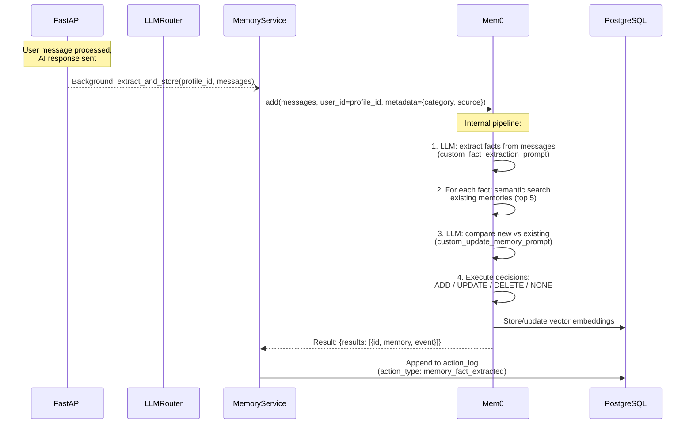
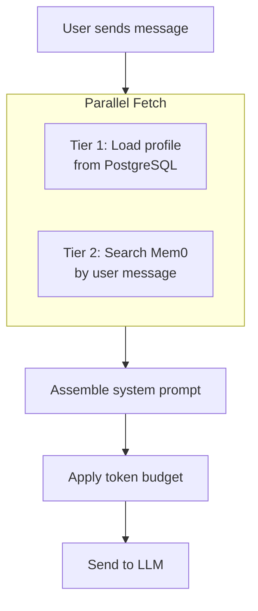
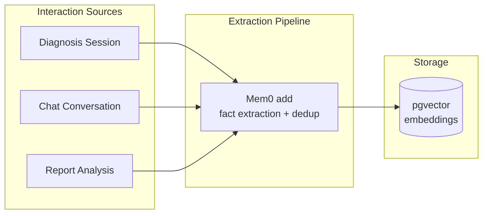
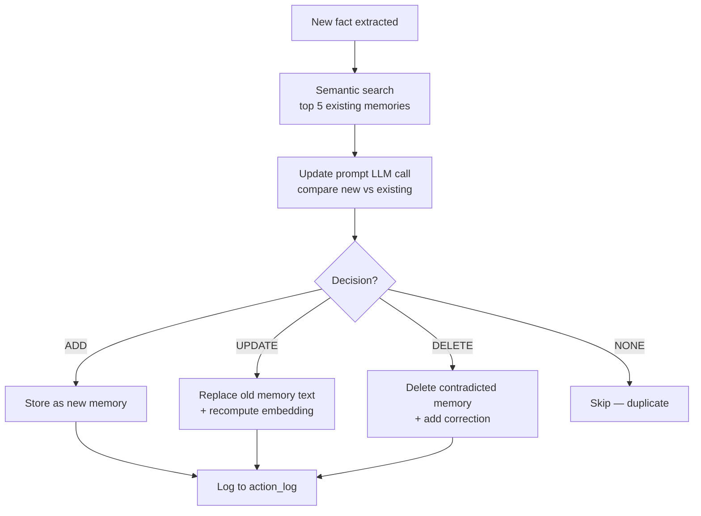

# FamilyHealth AI — Memory System Design

The memory system is the core differentiator of this platform. It gives the AI longitudinal awareness of each family member's health — not just what was said in the current conversation, but the accumulated medical context built over months and years of interactions.

## Table of Contents

1. [Three-Tier Architecture](#1-three-tier-architecture)
2. [Mem0 Configuration](#2-mem0-configuration)
3. [Memory Extraction Pipeline](#3-memory-extraction-pipeline)
4. [Memory Retrieval Pipeline](#4-memory-retrieval-pipeline)
5. [System Prompt Assembly](#5-system-prompt-assembly)
6. [Token Budget Management](#6-token-budget-management)
7. [Graph Memory](#7-graph-memory)
8. [Memory Lifecycle](#8-memory-lifecycle)
9. [Conflict Resolution](#9-conflict-resolution)
10. [Temporal Fact Handling](#10-temporal-fact-handling)

---

## 1. Three-Tier Architecture

| Tier | Store | Content | Updated By | Mutability |
|-|-|-|-|-|
| 1 — Structured Profile | PostgreSQL `profiles` table | Allergies, medications, conditions, blood type, family history | User edits + confirmed extractions | User-editable |
| 2 — Episodic Memory | Mem0 (pgvector) | Conversational facts, symptoms, lifestyle, lab results | Automatic post-interaction extraction | Auto-managed, user-deletable |
| 3 — Action Log | PostgreSQL `action_log` table | Every system action with full payload | System (automatic) | Append-only, immutable |

**Critical invariant:** Memory is scoped to `profile_id`, never `account_id`. A family account with 4 profiles has 4 completely independent memory stores. There is no mechanism to query across profiles.

---

## 2. Mem0 Configuration

### Full Production Config

```python
from mem0 import Memory

mem0_config = {
    "version": "v1.1",

    # ── LLM: used for fact extraction and update decisions ──
    "llm": {
        "provider": "openai",
        "config": {
            "model": "qwen3.5:35b",
            "api_key": QWEN_API_KEY,            # Ollama Cloud API key
            "openai_base_url": "https://ollama.com/v1",
            "temperature": 0.1,               # low temp for deterministic extraction
            "max_tokens": 2000,
        },
    },

    # ── Embeddings: Gemini (reuses existing Gemini API key) ──
    "embedder": {
        "provider": "gemini",
        "config": {
            "model": "models/text-embedding-004",
            "api_key": GEMINI_API_KEY,
            "embedding_dims": 768,
        },
    },

    # ── Vector store: pgvector in a dedicated database ──
    "vector_store": {
        "provider": "pgvector",
        "config": {
            "dbname": "mem0_db",
            "collection_name": "health_memories",
            "embedding_model_dims": 768,
            "host": PG_HOST,
            "port": PG_PORT,
            "user": PG_USER,
            "password": PG_PASSWORD,
            "hnsw": True,                      # HNSW index for fast ANN search
            "minconn": 2,
            "maxconn": 10,
        },
    },

    # ── Custom prompts: the core of our medical memory system ──
    "custom_fact_extraction_prompt": FACT_EXTRACTION_PROMPT,
    "custom_update_memory_prompt": UPDATE_MEMORY_PROMPT,
}

memory = Memory.from_config(mem0_config)
```

**Note:** Ollama Cloud provides an OpenAI-compatible API, so the LLM config uses the `openai` provider type. Embeddings use the `gemini` provider — this reuses the existing Gemini API key.

### Why Qwen for Mem0's Internal LLM

Mem0 calls its configured LLM for two internal tasks: fact extraction (on `add()`) and update-vs-duplicate decisions (when new facts overlap with existing ones). These are high-volume, structured-output tasks — Qwen via Ollama Cloud (free tier) is cost-effective and fast. Gemini is reserved for user-facing diagnosis and report analysis where accuracy is paramount.

### Profile Scoping

Every Mem0 call uses `user_id=str(profile.id)`. This is enforced by the `MemoryService` wrapper — no public method exists without a `profile_id` parameter.

```python
import asyncio

# MemoryService — the ONLY interface to Mem0 in the codebase
# All Mem0 calls are sync — wrapped in asyncio.to_thread() to avoid blocking the FastAPI event loop.

class MemoryService:
    def __init__(self, mem0_client: Memory) -> None:
        self._mem0 = mem0_client

    async def add(
        self,
        profile_id: UUID,
        messages: str | list[dict],
        *,
        category: str | None = None,
        source: str = "conversation",
    ) -> dict:
        metadata = {"source": source}
        if category:
            metadata["category"] = category
        return await asyncio.to_thread(
            self._mem0.add,
            messages,
            user_id=str(profile_id),
            metadata=metadata,
        )

    async def search(
        self,
        profile_id: UUID,
        query: str,
        *,
        limit: int = 10,
        categories: list[str] | None = None,
        threshold: float = 0.5,
    ) -> list[dict]:
        filters = None
        if categories:
            filters = {"category": {"in": categories}}
        result = await asyncio.to_thread(
            self._mem0.search,
            query,
            user_id=str(profile_id),
            limit=limit,
            filters=filters,
            threshold=threshold,
        )
        return result.get("results", [])

    async def get_all(
        self,
        profile_id: UUID,
        *,
        category: str | None = None,
        limit: int = 100,
    ) -> list[dict]:
        filters = {"category": category} if category else None
        result = await asyncio.to_thread(
            self._mem0.get_all,
            user_id=str(profile_id),
            filters=filters,
            limit=limit,
        )
        return result.get("results", [])

    async def get_history(self, memory_id: str) -> list[dict]:
        return await asyncio.to_thread(self._mem0.history, memory_id)

    async def delete(self, profile_id: UUID, memory_id: str) -> None:
        mem = await asyncio.to_thread(self._mem0.get, memory_id)
        if mem.get("user_id") != str(profile_id):
            raise ValueError("Memory does not belong to this profile")
        await asyncio.to_thread(self._mem0.delete, memory_id)

    async def delete_all(self, profile_id: UUID) -> None:
        await asyncio.to_thread(self._mem0.delete_all, user_id=str(profile_id))
```

### Memory Categories

Every memory is tagged with a `category` via Mem0's metadata system. Categories are used for filtered retrieval and organizing the memory summary UI.

| Category | Examples | Source |
|-|-|-|
| `medical_history` | "Diagnosed with type 2 diabetes in 2019" | Diagnosis sessions, reports |
| `medications` | "Currently taking metformin 500mg twice daily" | Chat, reports, profile |
| `allergies` | "Allergic to penicillin — causes rash" | Chat, profile edits |
| `diagnoses` | "Diagnosed with acute bronchitis on 2026-02-10" | Diagnosis sessions |
| `symptoms` | "Experiences recurring headaches in the morning" | Diagnosis sessions, chat |
| `lifestyle` | "Exercises 3x per week, mostly running" | Chat |
| `mental_health` | "Reports high stress at work, difficulty sleeping" | Chat |
| `lab_results` | "Hemoglobin 14.2 g/dL (normal) on 2026-02-20" | Report analysis |
| `vitals` | "Blood pressure 140/90 on 2026-01-15" | Chat, reports |
| `procedures` | "Appendectomy in 2015" | Chat, profile |

---

## 3. Memory Extraction Pipeline

### When Extraction Runs

Memory extraction is a **post-interaction background task**. It runs after the AI response is sent to the user, so it never blocks the request. The pipeline is identical for all interaction types (diagnosis, chat, report analysis).



### The Extraction Prompt

This is the `custom_fact_extraction_prompt` configured in Mem0. It replaces Mem0's default generic extraction prompt with one tuned for medical data.

```python
FACT_EXTRACTION_PROMPT = """You are a medical information extraction system. Your job is to
extract discrete, factual health information from a conversation between a user and a health
assistant.

Extract ONLY concrete health facts. Each fact should be:
- Self-contained (understandable without the conversation context)
- Specific (include dosages, dates, values, severity when mentioned)
- Attributed with temporal status (current vs. historical)
- One fact per item (don't combine multiple facts)

CATEGORIES to tag each fact with:
- medical_history: past diagnoses, surgeries, hospitalizations
- medications: current and past medications with dosage/frequency
- allergies: drug allergies, food allergies, environmental allergies
- diagnoses: new diagnoses from this or recent interactions
- symptoms: reported symptoms with duration, frequency, severity
- lifestyle: diet, exercise, sleep, smoking, alcohol
- mental_health: mood, stress, anxiety, sleep issues
- lab_results: test values with units, reference ranges, dates
- vitals: blood pressure, heart rate, weight, temperature
- procedures: surgeries, treatments, therapies

DO extract:
- "Started metformin 500mg twice daily in January 2026"
- "Blood pressure measured at 140/90 on 2026-02-15"
- "Allergic to penicillin — causes hives and throat swelling"
- "Father had heart attack at age 55"
- "Reports morning headaches for the past 2 weeks, severity 6/10"

DO NOT extract:
- Greetings, pleasantries, or conversational filler
- The AI's reasoning or diagnostic process
- Questions the AI asked (only extract the user's answers)
- Speculative statements ("might be", "could indicate")
- Generic health advice given by the AI

Input conversation:
{input}

Return a JSON object:
{{"facts": ["fact 1", "fact 2", ...]}}

If no extractable health facts exist, return: {{"facts": []}}"""
```

### The Update/Dedup Prompt

This is the `custom_update_memory_prompt` — it controls how Mem0 decides whether a new fact should be added, should replace an existing one, or is a duplicate.

```python
UPDATE_MEMORY_PROMPT = """You are a medical memory management system. You must decide how to
handle a new health fact relative to existing stored memories.

EXISTING MEMORIES:
{existing_memories}

NEW FACT:
{memory}

For the new fact, decide ONE action:

- "ADD": The fact is genuinely new information not covered by any existing memory.
- "UPDATE": The fact updates, corrects, or supersedes an existing memory. Return the
  updated_memory_id of the memory being replaced, and provide the merged/updated text.
  IMPORTANT: When a medication, condition, or status changes, the UPDATE should reflect
  the CURRENT state. Preserve the historical context by noting what changed.
  Example: Old="Takes metformin 500mg 2x daily" + New="Increased metformin to 1000mg"
  → Updated="Takes metformin 1000mg 2x daily (increased from 500mg)"
- "DELETE": The fact explicitly negates an existing memory (e.g., "No longer allergic to X"
  after allergy desensitization). Return the memory_id to delete.
- "NONE": The fact is already fully captured by an existing memory (exact duplicate or
  semantically identical). No action needed.

TEMPORAL RULES:
- A fact about a CURRENT state ("is taking", "currently has") should UPDATE any
  contradicting fact about the same subject.
- A fact about a PAST state ("was taking", "used to have") should be ADDED as new
  historical context, NOT used to update a current-state memory.
- If unclear whether current or historical, default to ADD.

Return JSON:
{{"type": "ADD" | "UPDATE" | "DELETE" | "NONE", "updated_memory_id": "..." | null, "memory": "updated text" | null}}"""
```

### Source-Specific Extraction

Different interaction types pass different metadata and may use per-call prompt overrides:

```python
class MemoryService:
    # ...

    async def extract_from_diagnosis(
        self, profile_id: UUID, messages: list[dict], session_id: str
    ) -> dict:
        """Extract memories from a diagnosis conversation turn."""
        return await self.add(
            profile_id,
            messages,
            category="diagnoses",
            source=f"diagnosis:{session_id}",
        )

    async def extract_from_report(
        self, profile_id: UUID, analysis: dict, report_id: str
    ) -> dict:
        """Extract memories from a completed report analysis."""
        # Format the analysis as a message for Mem0
        content = self._format_report_for_extraction(analysis)
        return await asyncio.to_thread(
            self._mem0.add,
            content,
            user_id=str(profile_id),
            metadata={"category": "lab_results", "source": f"report:{report_id}"},
            prompt=REPORT_EXTRACTION_PROMPT,   # per-call override
        )

    async def extract_from_chat(
        self, profile_id: UUID, messages: list[dict]
    ) -> dict:
        """Extract memories from a general health chat turn."""
        return await self.add(
            profile_id,
            messages,
            source="chat",
            # category is auto-assigned by the extraction prompt
        )
```

The report extraction uses a per-call `prompt` override since report analysis output is structured differently from conversation messages:

```python
REPORT_EXTRACTION_PROMPT = """You are extracting structured health facts from a medical
report analysis. The input is a JSON analysis of a lab report, blood test, or medical image.

Extract each finding as a standalone fact including:
- The measurement name and value with units
- Whether the value is normal, elevated, low, or critical
- The reference range if available
- The date of the test if available

Format each fact for long-term storage — it should be understandable months from now
without the original report.

Input:
{input}

Return: {{"facts": ["fact 1", "fact 2", ...]}}"""
```

---

## 4. Memory Retrieval Pipeline

### Retrieval Flow

Memory retrieval happens at the **start** of every LLM interaction, before the system prompt is assembled. It combines Tier 1 (profile facts) and Tier 2 (episodic memories).



### Tier 1 Retrieval: Profile Facts

Always loaded in full. This is a single DB row — no search needed.

```python
async def load_profile_context(db: AsyncSession, profile_id: UUID) -> dict:
    profile = await db.get(Profile, profile_id)
    return {
        "name": profile.name,
        "sex": profile.sex,
        "age": calculate_age(profile.date_of_birth),
        "blood_type": profile.blood_type,
        "allergies": profile.allergies,
        "current_medications": profile.current_medications,
        "medical_conditions": profile.medical_conditions,
        "family_medical_history": profile.family_medical_history,
    }
```

### Tier 2 Retrieval: Episodic Memories

Semantic search against Mem0, using the user's current message as the query. Retrieval strategy varies by interaction type:

```python
async def retrieve_memories(
    memory_service: MemoryService,
    profile_id: UUID,
    query: str,
    interaction_type: str,
) -> list[dict]:
    """Retrieve relevant episodic memories for an interaction."""

    if interaction_type == "diagnosis":
        # For diagnosis: retrieve medical history, symptoms, medications, past diagnoses
        # Use higher limit because diagnosis needs broad medical context
        memories = memory_service.search(
            profile_id,
            query,
            limit=15,
            categories=["medical_history", "medications", "allergies",
                         "diagnoses", "symptoms", "lab_results", "vitals"],
            threshold=0.4,   # lower threshold = cast wider net
        )

    elif interaction_type == "report_analysis":
        # For reports: retrieve past lab results for trend comparison
        memories = memory_service.search(
            profile_id,
            query,
            limit=10,
            categories=["lab_results", "vitals", "medications", "medical_history"],
            threshold=0.5,
        )

    elif interaction_type == "chat":
        # For chat: retrieve broadly — any category could be relevant
        memories = memory_service.search(
            profile_id,
            query,
            limit=10,
            threshold=0.5,
        )

    else:
        memories = []

    return memories
```

### Memory Object Shape

Each item returned from `memory_service.search()`:

```python
{
    "id": "abc-123-uuid",
    "memory": "Takes metformin 1000mg twice daily (increased from 500mg in Jan 2026)",
    "hash": "sha256...",
    "metadata": {
        "category": "medications",
        "source": "diagnosis:session-456",
    },
    "score": 0.87,               # cosine similarity to the query
    "created_at": "2026-01-15T10:30:00Z",
    "updated_at": "2026-02-01T14:20:00Z",
}
```

---

## 5. System Prompt Assembly

### Template

The system prompt is assembled from three layers: static instructions, profile facts (Tier 1), and episodic memories (Tier 2). The template varies by interaction type.

The diagnosis system prompt template is defined in `DIAGNOSIS_AGENT.md` Section 2. It follows the same assembly pattern shown below but with additional clinical protocol instructions. Structured state extraction uses a two-pass approach (see DIAGNOSIS_AGENT.md Section 3).

### Prompt Assembly Code

```python
def assemble_system_prompt(
    template: str,
    profile_context: dict,
    episodic_memories: list[dict],
    token_budget: int,
) -> str:
    """Assemble the system prompt with profile facts and episodic memories."""

    # Format profile facts (Tier 1) — always included in full
    profile_section = {
        "profile_name": profile_context["name"],
        "age": profile_context["age"] or "Unknown",
        "sex": profile_context["sex"] or "Not specified",
        "blood_type": profile_context["blood_type"] or "Unknown",
        "allergies": format_allergies(profile_context["allergies"]) or "None known",
        "medications": format_medications(profile_context["current_medications"]) or "None",
        "conditions": format_conditions(profile_context["medical_conditions"]) or "None known",
        "family_history": format_family_history(profile_context["family_medical_history"]) or "None reported",
    }

    # Format episodic memories (Tier 2) — trimmed to token budget
    memory_lines = []
    for mem in episodic_memories:
        category = mem.get("metadata", {}).get("category", "general")
        line = f"- [{category}] {mem['memory']}"
        memory_lines.append(line)

    memories_text = "\n".join(memory_lines) if memory_lines else "No relevant history found."

    # Apply token budget — truncate memories if they exceed the budget
    memories_text = truncate_to_token_budget(memories_text, token_budget)

    return template.format(**profile_section, episodic_memories=memories_text)
```

### Chat Variant

```python
CHAT_SYSTEM_PROMPT = """You are a friendly health assistant for {profile_name}.

## MEDICAL DISCLAIMER
You provide general health information, NOT medical diagnoses. Always recommend consulting
a healthcare professional for specific medical concerns.

## PATIENT PROFILE
- Age: {age} | Sex: {sex}
- Allergies: {allergies}
- Medications: {medications}
- Conditions: {conditions}

## RELEVANT CONTEXT
{episodic_memories}

## INSTRUCTIONS
- Answer health questions conversationally and accurately.
- Reference the patient's profile and history when relevant.
- If the question involves symptoms that could indicate a serious condition,
  recommend using the Diagnosis feature for a structured assessment.
- Be concise. Don't lecture unless asked for detail."""
```

---

## 6. Token Budget Management

LLMs have fixed context windows. We must allocate tokens carefully across the prompt components.

### Budget Allocation

Using Gemini 2.0 Flash (1M context) for diagnosis and Qwen for chat, but we target much smaller windows to control cost and latency:

| Component | Diagnosis Budget | Chat Budget | Notes |
|-|-|-|-|
| System instructions | ~500 tokens | ~300 tokens | Static template text |
| Profile facts (Tier 1) | ~400 tokens | ~300 tokens | Always included in full |
| Episodic memories (Tier 2) | ~2,000 tokens | ~1,000 tokens | Trimmed by relevance score |
| Conversation history | ~4,000 tokens | ~3,000 tokens | Recent turns, oldest dropped first |
| **Response budget** | ~2,000 tokens | ~1,500 tokens | Reserved for generation |
| **Total target** | ~9,000 tokens | ~6,000 tokens | Well within model limits |

### Truncation Strategy

```python
import tiktoken

# Use cl100k_base as a reasonable approximation for both Gemini and Qwen
_encoder = tiktoken.get_encoding("cl100k_base")


def count_tokens(text: str) -> int:
    return len(_encoder.encode(text))


def truncate_to_token_budget(text: str, max_tokens: int) -> str:
    """Truncate text to fit within a token budget, preserving complete lines."""
    tokens = _encoder.encode(text)
    if len(tokens) <= max_tokens:
        return text

    # Truncate to budget, then find the last complete line
    truncated = _encoder.decode(tokens[:max_tokens])
    last_newline = truncated.rfind("\n")
    if last_newline > 0:
        truncated = truncated[:last_newline]

    return truncated + "\n- [... additional history truncated for context limit]"


def build_conversation_window(
    messages: list[dict],
    max_tokens: int,
) -> list[dict]:
    """Select the most recent messages that fit within the token budget.

    Always includes the first message (chief complaint for diagnosis)
    and then fills from the most recent backwards.
    """
    if not messages:
        return []

    first_msg = messages[0]
    first_tokens = count_tokens(first_msg["content"])

    remaining_budget = max_tokens - first_tokens
    selected = []

    # Walk backwards from most recent, accumulating until budget is exceeded
    for msg in reversed(messages[1:]):
        msg_tokens = count_tokens(msg["content"])
        if msg_tokens > remaining_budget:
            break
        selected.insert(0, msg)
        remaining_budget -= msg_tokens

    return [first_msg] + selected
```

### Why Not Use the Full Context Window?

Even though Gemini supports 1M tokens:
1. **Cost**: LLM pricing is per-token. Sending 100K tokens per turn gets expensive fast at the volume of a consumer health app.
2. **Latency**: More input tokens = slower time-to-first-token.
3. **Relevance decay**: Injecting 500 memories is worse than 10 relevant ones — the LLM's attention is diluted.
4. **Consistency**: Keeping the window small and deterministic makes behavior predictable and testable.

---

## 7. Graph Memory

> **v2 Feature:** Graph memory (Neo4j) is deferred to v2. For v1, Mem0 uses pgvector only. The design below is preserved for future reference.

### How It Works

When `graph_store` is configured, Mem0's `add()` call performs **two parallel extractions**:

1. **Vector extraction** (default): facts → embeddings → pgvector
2. **Graph extraction** (additional): entities + relationships → Neo4j nodes + edges

The graph is extracted by a separate LLM call that identifies entities (people, conditions, medications, body parts) and their relationships.

### What the Graph Captures

```
[Patient: Mom] --HAS_CONDITION--> [Condition: Type 2 Diabetes]
[Condition: Type 2 Diabetes] --TREATED_WITH--> [Medication: Metformin 1000mg]
[Medication: Metformin] --SIDE_EFFECT--> [Symptom: Nausea]
[Patient: Mom] --ALLERGIC_TO--> [Substance: Penicillin]
[Lab Test: HbA1c] --MEASURES--> [Condition: Type 2 Diabetes]
[Lab Test: HbA1c] --RESULT--> [Value: 7.2% on 2026-02-20]
[Condition: Hypertension] --COMORBID_WITH--> [Condition: Type 2 Diabetes]
[Patient: Mom] --FAMILY_HISTORY--> [Condition: Heart Disease (Father)]
```

### Graph-Augmented Search

When `memory_service.search()` is called, Mem0 returns both vector search results and graph-traversal results. The `relations` field in the response contains related entities discovered via graph traversal:

```python
result = memory.search("blood sugar control", user_id=str(profile_id))

# result["results"] — vector search matches (facts)
# result["relations"] — graph-traversed related entities

# Example relations:
# [
#   {"source": "Type 2 Diabetes", "relationship": "TREATED_WITH", "target": "Metformin 1000mg"},
#   {"source": "HbA1c", "relationship": "MEASURES", "target": "Type 2 Diabetes"},
# ]
```

This is powerful for medical context: when a user asks about blood sugar, the graph can surface the medication treating it, the lab test that measures it, and comorbid conditions — even if those facts don't share keywords with the query.

### Direct Graph Queries (Admin/Debug)

For admin tooling, we can query Neo4j directly via Cypher to visualize a patient's health graph:

```cypher
// Get all entities and relationships for a profile
MATCH (n)-[r]->(m)
WHERE n.user_id = $profile_id
RETURN n, r, m

// Find all medications for conditions
MATCH (c:Condition)-[:TREATED_WITH]->(m:Medication)
WHERE c.user_id = $profile_id
RETURN c.name, m.name, m.dosage

// Find potential drug interactions (conditions treated by multiple meds)
MATCH (c:Condition)-[:TREATED_WITH]->(m1:Medication),
      (c)-[:TREATED_WITH]->(m2:Medication)
WHERE c.user_id = $profile_id AND m1 <> m2
RETURN c.name, m1.name, m2.name
```

---

## 8. Memory Lifecycle

### Creation

Memories are created via three paths:



**What triggers creation:**

| Source | Trigger | Category Assignment |
|-|-|-|
| Diagnosis message | After each AI response | `diagnoses`, `symptoms`, `medications` |
| Chat message | After each AI response | Auto-detected by extraction prompt |
| Report analysis | After analysis completes | `lab_results`, `vitals` |
| Profile edit | Sync to Mem0 for searchability | Matches the edited field |

### Retrieval

Semantic search — described in [Section 4](#4-memory-retrieval-pipeline).

### Update

Handled automatically by Mem0's internal pipeline:

1. New fact is extracted from a conversation.
2. Mem0 searches for the top-5 most similar existing memories.
3. The update prompt (Section 3) decides: ADD, UPDATE, DELETE, or NONE.
4. If UPDATE: the old memory text is replaced with the merged text, and the embedding is recomputed.

**Example — medication dosage change:**

```
Existing memory: "Takes metformin 500mg twice daily"
New fact from conversation: "Doctor increased metformin to 1000mg"

Update prompt decides: UPDATE
New memory: "Takes metformin 1000mg twice daily (increased from 500mg, Feb 2026)"
```

The `memory.history(memory_id)` API preserves the full change log:

```python
memory.history("mem-uuid-123")
# [
#   {
#     "id": "event-1",
#     "memory_id": "mem-uuid-123",
#     "old_memory": None,
#     "new_memory": "Takes metformin 500mg twice daily",
#     "event": "ADD",
#     "timestamp": "2026-01-15T10:30:00Z",
#   },
#   {
#     "id": "event-2",
#     "memory_id": "mem-uuid-123",
#     "old_memory": "Takes metformin 500mg twice daily",
#     "new_memory": "Takes metformin 1000mg twice daily (increased from 500mg, Feb 2026)",
#     "event": "UPDATE",
#     "timestamp": "2026-02-20T09:00:00Z",
#   },
# ]
```

### Archival

There is no separate "archive" state in Mem0. Instead, resolved/historical conditions are handled by temporal tagging in the memory text itself:

- Active: `"Currently taking metformin 1000mg twice daily"`
- Resolved: `"Had acute bronchitis in Feb 2026 (resolved with antibiotics)"`
- Discontinued: `"Was on lisinopril 10mg until Jan 2026 (discontinued — switched to amlodipine)"`

The extraction and update prompts are designed to produce these temporal markers (see [Section 10](#10-temporal-fact-handling)).

Memories naturally decay in relevance: as they age and as the profile accumulates more recent, more relevant facts, old memories rank lower in semantic search results. They are never deleted automatically.

### Deletion

Two deletion mechanisms:

**User-initiated** (via API):

```python
# DELETE /profiles/{pid}/memory/{mid}
async def delete_memory(
    mid: str,
    profile: Profile = Depends(get_verified_profile),
    memory_service: MemoryService = Depends(get_memory_service),
    db: AsyncSession = Depends(get_db),
) -> None:
    memory_service.delete(profile.id, mid)

    # Log the deletion
    await log_action(db, profile.id, profile.account_id, "memory_deleted", {
        "memory_id": mid,
        "reason": "user_request",
    })
```

**Profile deletion** (cascade):

```python
# When a profile is deleted, wipe all its memories
async def delete_profile(profile_id: UUID, ...) -> None:
    # ... delete from PostgreSQL tables (CASCADE handles this) ...
    memory_service.delete_all(profile_id)  # wipe Mem0 memories
```

---

## 9. Conflict Resolution

### How Conflicts Arise

| Scenario | Example | Resolution |
|-|-|-|
| Dosage change | Old: "metformin 500mg" / New: "metformin 1000mg" | UPDATE — merge into current state |
| Condition resolved | Old: "has bronchitis" / New: "bronchitis resolved" | UPDATE — mark as historical |
| Contradicting results | Old: "cholesterol 220 (elevated)" / New: "cholesterol 195 (normal)" | ADD — both are valid (different dates) |
| Allergy correction | Old: "allergic to amoxicillin" / New: "not actually allergic to amoxicillin, was a misdiagnosis" | DELETE old + ADD correction |
| Duplicate | Old: "type 2 diabetes diagnosed 2019" / New: "has diabetes since 2019" | NONE — semantically identical |

### Conflict Resolution Flow



### Tier 1 ↔ Tier 2 Sync

For v1, Tier 2 facts are never auto-promoted to Tier 1. Users update their profile (Tier 1) manually. This prevents LLM hallucinations from corrupting structured profile data. Automated Tier 1 update suggestions are planned for v2.

---

## 10. Temporal Fact Handling

Medical facts have a time dimension that is critical to get right. "Was on metformin" and "is on metformin" are completely different clinical contexts.

### Temporal States

| State | Markers in Text | Example |
|-|-|-|
| Current / Active | "currently", "is", "takes", "has" | "Currently taking metformin 1000mg" |
| Historical / Resolved | "had", "was", "previously", "resolved", "in [year]" | "Had bronchitis in Feb 2026 (resolved)" |
| Discontinued | "stopped", "discontinued", "switched from" | "Discontinued lisinopril — switched to amlodipine" |
| Recurring | "recurring", "chronic", "episodic" | "Recurring migraines, ~2x per month" |
| Scheduled | "upcoming", "scheduled for" | "Colonoscopy scheduled for March 2026" |

### How Temporal State Is Preserved

The extraction prompt instructs the LLM to include temporal markers. The update prompt preserves them during merges:

**Scenario: Patient stops a medication**

```
Turn 1 (January):
  User: "I started taking lisinopril 10mg for blood pressure"
  → Memory created: "Currently taking lisinopril 10mg daily for hypertension"

Turn 2 (February):
  User: "My doctor switched me from lisinopril to amlodipine"
  → Mem0 internal process:
    1. Extracts: "Switched from lisinopril to amlodipine"
    2. Finds existing: "Currently taking lisinopril 10mg daily for hypertension"
    3. Update prompt decides: UPDATE
    4. New memory: "Was on lisinopril 10mg (discontinued Feb 2026).
       Switched to amlodipine for hypertension."
  → Separately ADDs: "Currently taking amlodipine for hypertension (started Feb 2026)"
```

**Scenario: Lab result over time**

```
Report 1 (January): cholesterol = 220 mg/dL (elevated)
  → Memory: "Total cholesterol 220 mg/dL (elevated) — Jan 2026"

Report 2 (April): cholesterol = 195 mg/dL (normal)
  → Mem0 process:
    1. Finds existing cholesterol memory
    2. Update prompt sees these are different time points
    3. Decision: ADD (not update — both data points are valid)
  → New memory: "Total cholesterol 195 mg/dL (normal) — Apr 2026"
  → Both memories coexist, allowing trend analysis
```

### Date Extraction Heuristic

The extraction prompt encourages dates, but users often omit them. When no date is explicit, the system stamps the interaction date:

```python
def enrich_messages_with_date(messages: list[dict]) -> list[dict]:
    """Prepend today's date as context for the extraction LLM."""
    today = date.today().isoformat()
    date_context = {
        "role": "system",
        "content": f"Today's date is {today}. If the user mentions health facts "
                   f"without specifying dates, assume they refer to today or the recent past.",
    }
    return [date_context] + messages
```

This ensures that even without explicit dates, Mem0's extraction produces temporally grounded facts like "Blood pressure 140/90 (reported Feb 2026)" rather than undated "Blood pressure is 140/90."
